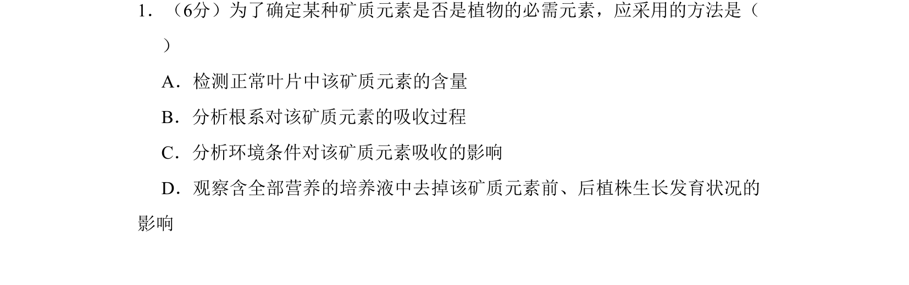
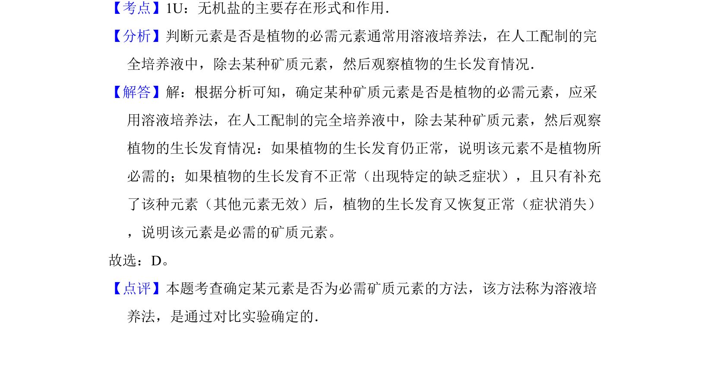

## 题面

## 摘要

该题考查通过溶液培养法确定植物必需矿质元素的方法

## 关联考点

- [[212-无机盐|无机盐]]
- [[762-溶液培养法|溶液培养法]]
- [[485-对照实验|对照实验]]

## 答案与解析

> 📄 原 PDF 第 1 页：`素材/真题/吉林/2008-2024·（吉林）生物高考真题/2008年高考生物试卷（全国卷Ⅱ）（解析卷）.pdf`

<!-- 题干文本-start -->
## 题干文本
1．（6分）为了确定某种矿质元素是否是植物的必需元素，应采用的方法是（　　
）
A．检测正常叶片中该矿质元素的含量
B．分析根系对该矿质元素的吸收过程
C．分析环境条件对该矿质元素吸收的影响
D．观察含全部营养的培养液中去掉该矿质元素前、后植株生长发育状况的
影响
<!-- 题干文本-end -->

<!-- 解析文本-start -->
## 解析文本
【考点】1U：无机盐的主要存在形式和作用．菁优网版权所有
【分析】判断元素是否是植物的必需元素通常用溶液培养法，在人工配制的完
全培养液中，除去某种矿质元素，然后观察植物的生长发育情况．
【解答】解：根据分析可知，确定某种矿质元素是否是植物的必需元素，应采
用溶液培养法，在人工配制的完全培养液中，除去某种矿质元素，然后观察
植物的生长发育情况：如果植物的生长发育仍正常，说明该元素不是植物所
必需的；如果植物的生长发育不正常（出现特定的缺乏症状），且只有补充
了该种元素（其他元素无效）后，植物的生长发育又恢复正常（症状消失）
，说明该元素是必需的矿质元素。
故选：D。
【点评】本题考查确定某元素是否为必需矿质元素的方法，该方法称为溶液培
养法，是通过对比实验确定的．
<!-- 解析文本-end -->
