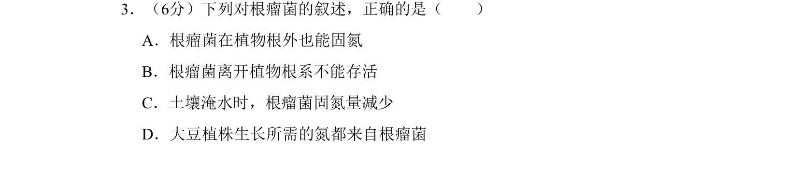
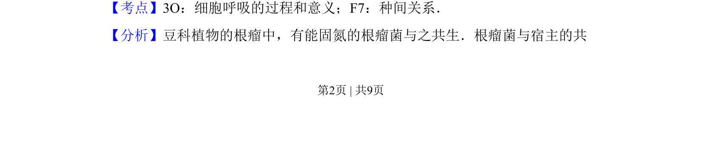
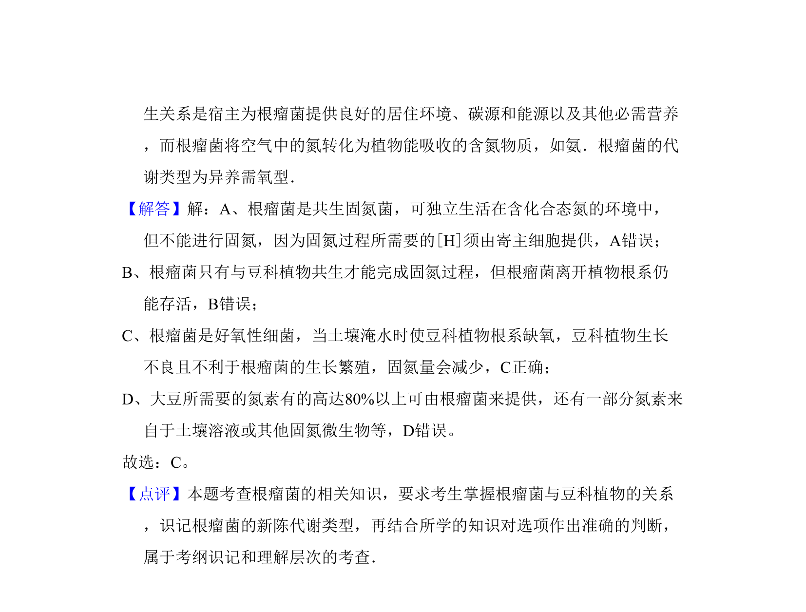

## 题面

## 摘要

该题考查根瘤菌与植物共生固氮的条件及影响因素。

## 关联考点

- [[241-细胞呼吸|细胞呼吸]]
- [[022-生物因素|种间关系]]
- [[571-固氮作用|固氮作用]]

## 答案与解析

> 📄 原 PDF 第 2 页：`素材/真题/吉林/2008-2024·（吉林）生物高考真题/2008年高考生物试卷（全国卷Ⅱ）（解析卷）.pdf`

<!-- 题干文本-start -->
## 题干文本
3．（6分）下列对根瘤菌的叙述，正确的是（　　）
A．根瘤菌在植物根外也能固氮
B．根瘤菌离开植物根系不能存活
C．土壤淹水时，根瘤菌固氮量减少
D．大豆植株生长所需的氮都来自根瘤菌
<!-- 题干文本-end -->

<!-- 解析文本-start -->
## 解析文本
【考点】3O：细胞呼吸的过程和意义；F7：种间关系．菁优网版权所有
【分析】豆科植物的根瘤中，有能固氮的根瘤菌与之共生．根瘤菌与宿主的共
<!-- 解析文本-end -->
