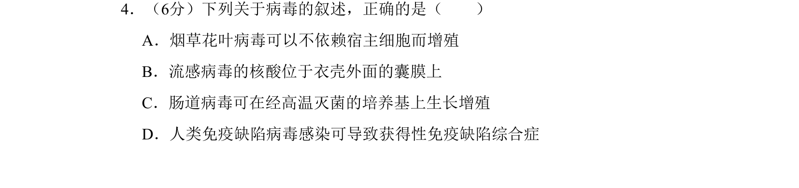
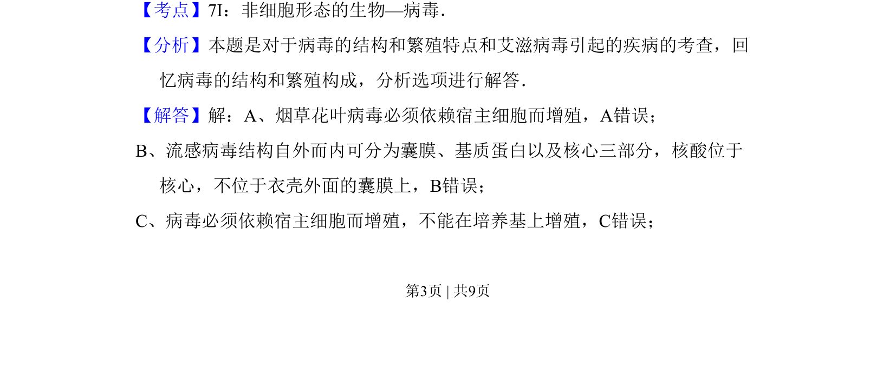
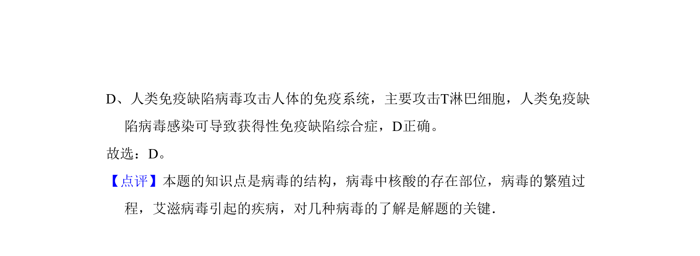

## 题面

## 摘要

本题考查病毒的结构、繁殖特点及与人类疾病的关系，要求辨析病毒相关叙述的正误。

## 关联考点

- [[653-病毒结构|病毒的结构]]
- [[652-病毒的增殖方式|病毒的增殖方式]]
- [[692-艾滋病病毒与免疫缺陷病|艾滋病病毒与免疫缺陷病]]

## 答案与解析

> 📄 原 PDF 第 3 页：`素材/真题/吉林/2008-2024·（吉林）生物高考真题/2008年高考生物试卷（全国卷Ⅱ）（解析卷）.pdf`

<!-- 题干文本-start -->
## 题干文本
4．（6分）下列关于病毒的叙述，正确的是（　　）
A．烟草花叶病毒可以不依赖宿主细胞而增殖
B．流感病毒的核酸位于衣壳外面的囊膜上
C．肠道病毒可在经高温灭菌的培养基上生长增殖
D．人类免疫缺陷病毒感染可导致获得性免疫缺陷综合症
<!-- 题干文本-end -->

<!-- 解析文本-start -->
## 解析文本
【考点】7I：非细胞形态的生物—病毒．菁优网版权所有
【分析】本题是对于病毒的结构和繁殖特点和艾滋病毒引起的疾病的考查，回
忆病毒的结构和繁殖构成，分析选项进行解答．
【解答】解：A、烟草花叶病毒必须依赖宿主细胞而增殖，A错误；
B、流感病毒结构自外而内可分为囊膜、基质蛋白以及核心三部分，核酸位于
核心，不位于衣壳外面的囊膜上，B错误；
C、病毒必须依赖宿主细胞而增殖，不能在培养基上增殖，C错误；
<!-- 解析文本-end -->
