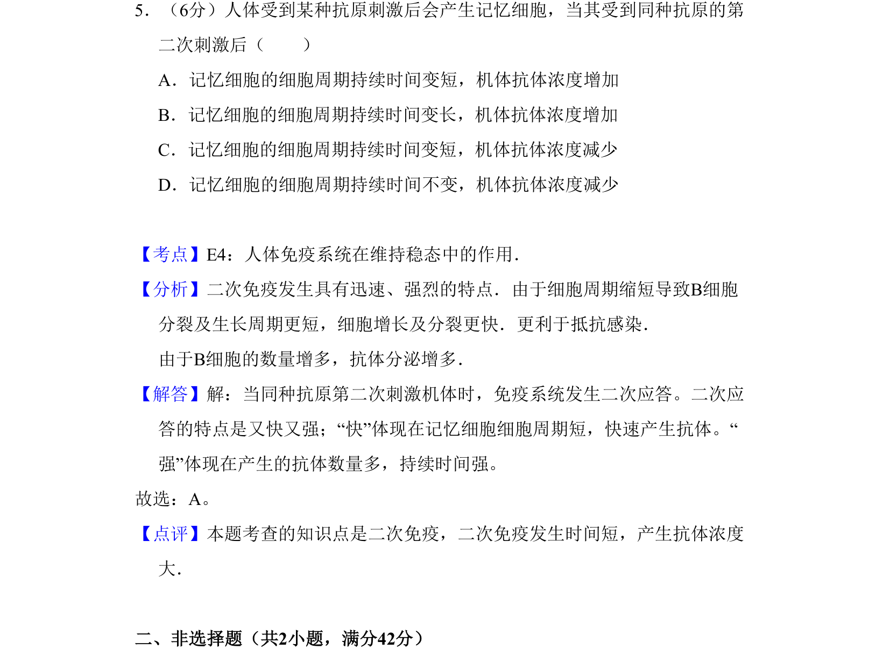
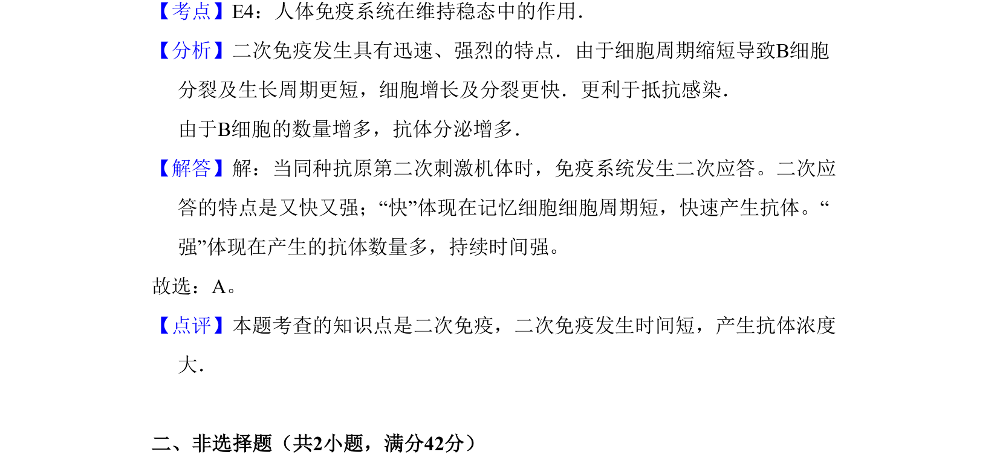

## 题面

## 摘要

二次免疫应答中记忆细胞快速增殖分化，产生大量抗体，细胞周期缩短，抗体浓度升高。

## 关联考点

- [[540-人体免疫系统在维持稳态中的作用|人体免疫系统在维持稳态中的作用]]
- [[737-二次免疫应答|二次免疫应答]]

## 答案与解析

> 📄 原 PDF 第 4 页：`素材/真题/吉林/2008-2024·（吉林）生物高考真题/2008年高考生物试卷（全国卷Ⅱ）（解析卷）.pdf`

<!-- 题干文本-start -->
## 题干文本
5．（6分）人体受到某种抗原刺激后会产生记忆细胞，当其受到同种抗原的第
二次刺激后（　　）
A．记忆细胞的细胞周期持续时间变短，机体抗体浓度增加
B．记忆细胞的细胞周期持续时间变长，机体抗体浓度增加
C．记忆细胞的细胞周期持续时间变短，机体抗体浓度减少
D．记忆细胞的细胞周期持续时间不变，机体抗体浓度减少
<!-- 题干文本-end -->

<!-- 解析文本-start -->
## 解析文本
【考点】E4：人体免疫系统在维持稳态中的作用．菁优网版权所有
【分析】二次免疫发生具有迅速、强烈的特点．由于细胞周期缩短导致B细胞
分裂及生长周期更短，细胞增长及分裂更快．更利于抵抗感染． 
由于B细胞的数量增多，抗体分泌增多．
【解答】解：当同种抗原第二次刺激机体时，免疫系统发生二次应答。二次应
答的特点是又快又强；“快”体现在记忆细胞细胞周期短，快速产生抗体。“
强”体现在产生的抗体数量多，持续时间强。
故选：A。
【点评】本题考查的知识点是二次免疫，二次免疫发生时间短，产生抗体浓度
大．
　
二、非选择题（共2小题，满分42分）
<!-- 解析文本-end -->
