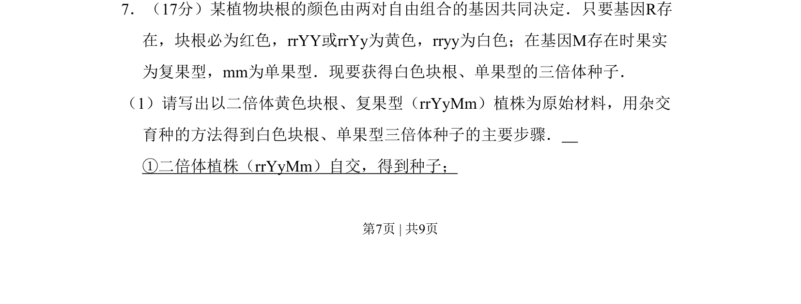
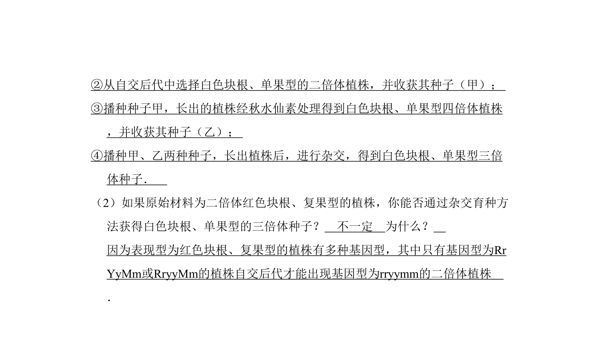
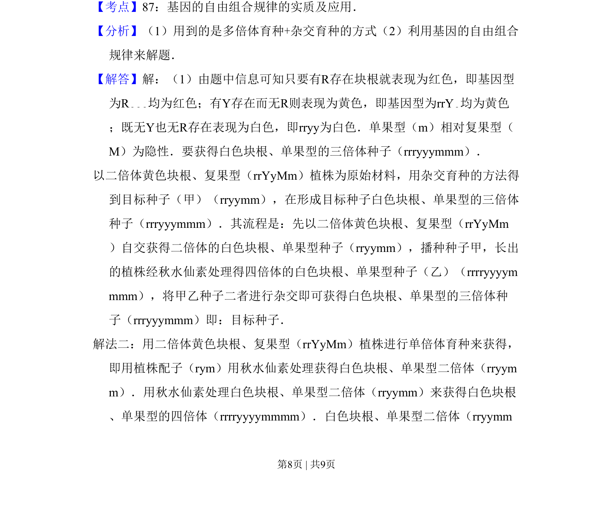
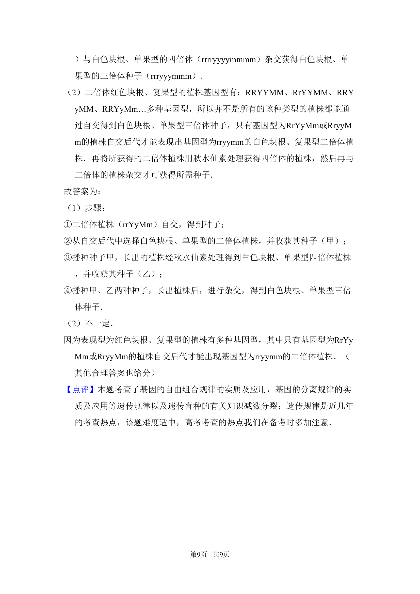

## 题面

## 摘要

该题考查基因自由组合定律在杂交育种中的应用，涉及三倍体种子获得方法。

## 关联考点

- [[580-基因自由组合定律|基因自由组合定律]]
- [[493-杂交育种|杂交育种]]
- [[303-多倍体|多倍体]]

## 答案与解析

> 📄 原 PDF 第 7 页：`素材/真题/吉林/2008-2024·（吉林）生物高考真题/2008年高考生物试卷（全国卷Ⅱ）（解析卷）.pdf`

<!-- 题干文本-start -->
## 题干文本
7．（17分）某植物块根的颜色由两对自由组合的基因共同决定．只要基因R存
在，块根必为红色，rrYY或rrYy为黄色，rryy为白色；在基因M存在时果实
为复果型，mm为单果型．现要获得白色块根、单果型的三倍体种子．
（1）请写出以二倍体黄色块根、复果型（rrYyMm）植株为原始材料，用杂交
育种的方法得到白色块根、单果型三倍体种子的主要步骤．　
①二倍体植株（rrYyMm）自交，得到种子；
<!-- 题干文本-end -->

<!-- 解析文本-start -->
## 解析文本

<!-- 解析文本-end -->
