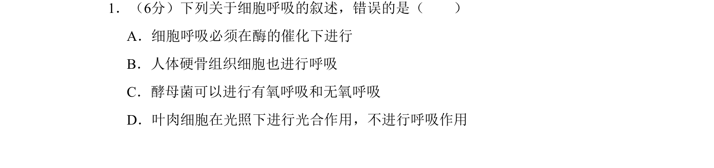
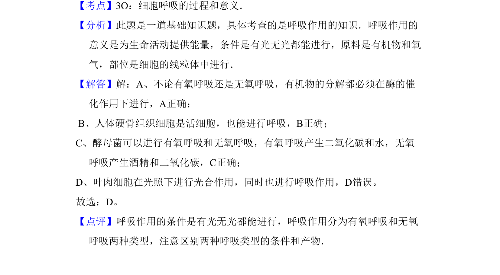

## 题面

## 摘要

本题考查细胞呼吸的基本概念和条件，辨析光合作用与呼吸作用的关系。

## 关联考点

- [[241-细胞呼吸|细胞呼吸]]
- [[240-有氧呼吸|有氧呼吸]]
- [[238-无氧呼吸|无氧呼吸]]

## 答案与解析

> 📄 原 PDF 第 1 页：`素材/真题/吉林/2008-2024·（吉林）生物高考真题/2009年高考生物试卷（全国卷Ⅱ）（解析卷）.pdf`
