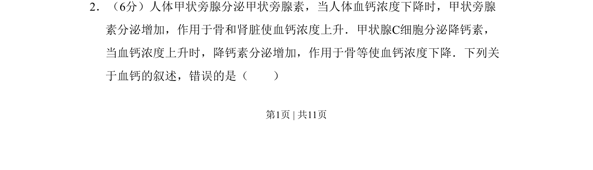
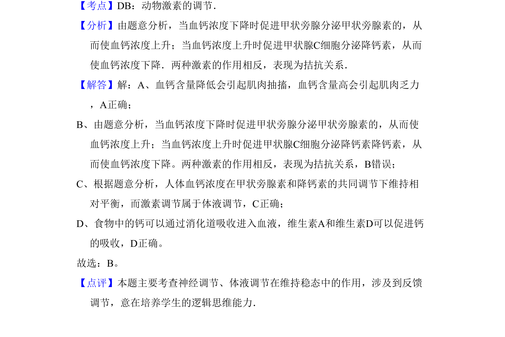

## 题面

## 摘要

甲状旁腺素和降钙素对血钙浓度的反馈调节机制

## 关联考点

- [[331-激素调节|激素调节]]
- [[334-反馈调节|反馈调节]]
- [[704-血钙稳态|血钙稳态]]
- [[648-甲状腺旁腺|甲状腺旁腺]]

## 答案与解析

> 📄 原 PDF 第 1 页：`素材/真题/吉林/2008-2024·（吉林）生物高考真题/2009年高考生物试卷（全国卷Ⅱ）（解析卷）.pdf`
