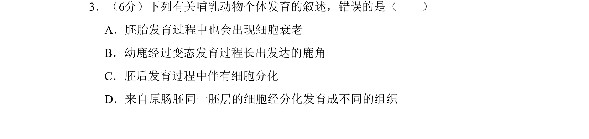
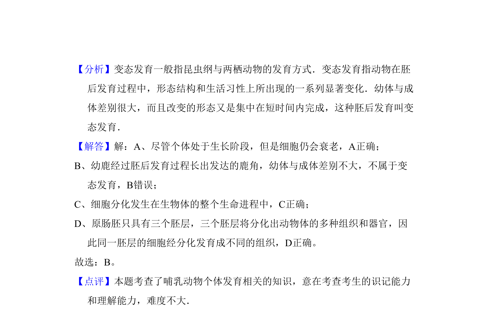

## 题面

## 摘要

本题考查哺乳动物个体发育相关叙述的正误判断，涉及胚胎发育、细胞衰老、变态发育和细胞分化等概念。

## 关联考点

- [[558-动物胚胎发育过程|动物胚胎发育过程]]
- [[254-细胞衰老|细胞衰老]]
- [[171-两栖动物变态发育|变态发育]]
- [[045-细胞分化|细胞分化]]

## 答案与解析

> 📄 原 PDF 第 2 页：`素材/真题/吉林/2008-2024·（吉林）生物高考真题/2009年高考生物试卷（全国卷Ⅱ）（解析卷）.pdf`
