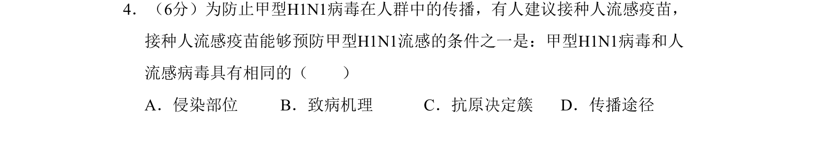
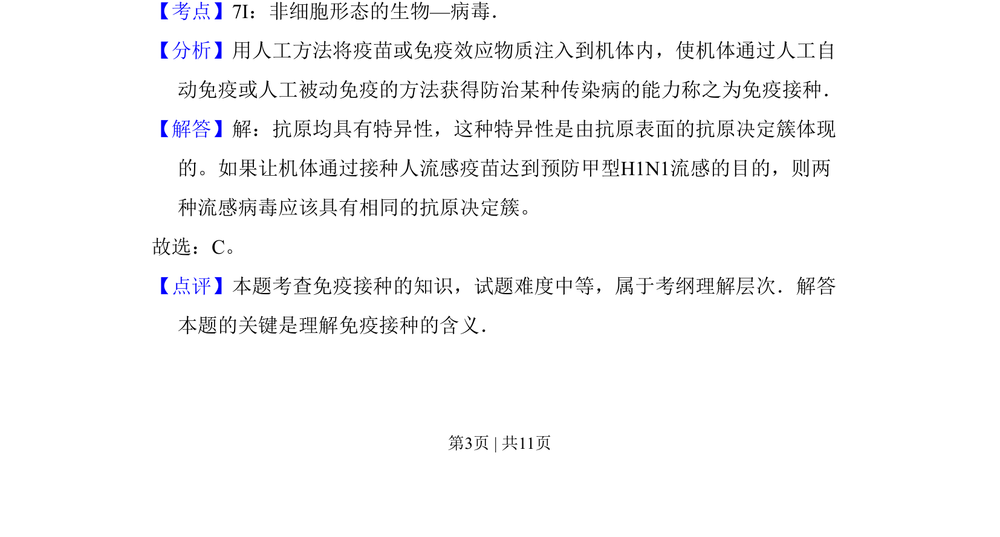

## 题面

## 摘要

本题通过免疫接种实例考查病毒抗原特异性的基础知识。

## 关联考点

- [[764-抗原决定簇|抗原决定簇]]
- [[547-免疫接种|免疫接种]]
- [[651-病毒特性|病毒特性]]

## 答案与解析

> 📄 原 PDF 第 3 页：`素材/真题/吉林/2008-2024·（吉林）生物高考真题/2009年高考生物试卷（全国卷Ⅱ）（解析卷）.pdf`

<!-- 题干文本-start -->
## 题干文本
4．（6分）为防止甲型H1N1病毒在人群中的传播，有人建议接种人流感疫苗，
接种人流感疫苗能够预防甲型H1N1流感的条件之一是：甲型H1N1病毒和人
流感病毒具有相同的（　　）
A．侵染部位B．致病机理C．抗原决定簇D．传播途径
<!-- 题干文本-end -->

<!-- 解析文本-start -->
## 解析文本
【考点】7I：非细胞形态的生物—病毒．菁优网版权所有
【分析】用人工方法将疫苗或免疫效应物质注入到机体内，使机体通过人工自
动免疫或人工被动免疫的方法获得防治某种传染病的能力称之为免疫接种．
【解答】解：抗原均具有特异性，这种特异性是由抗原表面的抗原决定簇体现
的。如果让机体通过接种人流感疫苗达到预防甲型H1N1流感的目的，则两
种流感病毒应该具有相同的抗原决定簇。
故选：C。
【点评】本题考查免疫接种的知识，试题难度中等，属于考纲理解层次．解答
本题的关键是理解免疫接种的含义．
<!-- 解析文本-end -->
