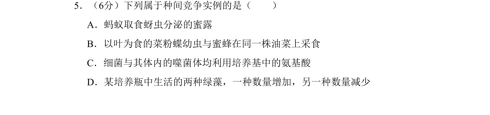
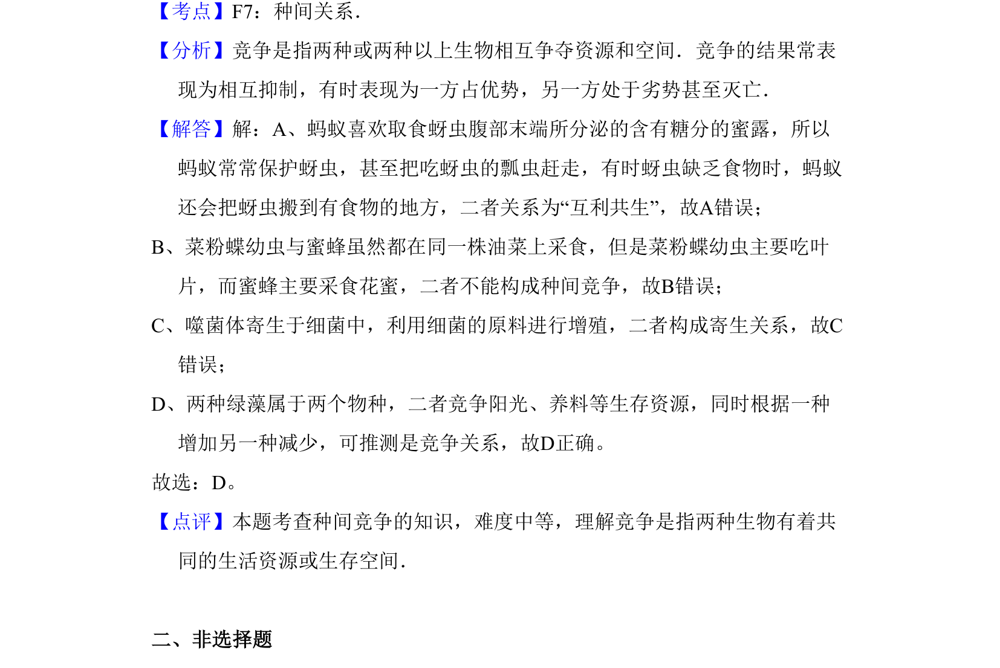

## 题面

## 摘要

该题考查生物种间关系的辨析，通过实例判断互利共生、寄生与竞争的区别。

## 关联考点

- [[022-生物因素|种间关系]]
- [[765-竞争|竞争]]
- [[405-寄生|寄生]]
- [[404-互利共生|互利共生]]

## 答案与解析

> 📄 原 PDF 第 4 页：`素材/真题/吉林/2008-2024·（吉林）生物高考真题/2009年高考生物试卷（全国卷Ⅱ）（解析卷）.pdf`
