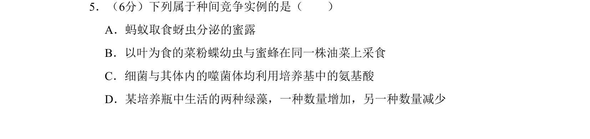
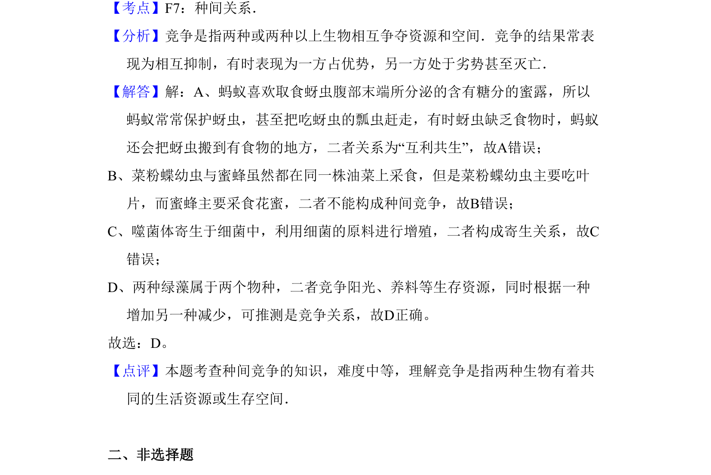

## 题面

## 摘要

该题考查生物种间关系的辨析，通过实例判断互利共生、寄生与竞争的区别。

## 关联考点

- [[022-生物因素|种间关系]]
- [[765-竞争|竞争]]
- [[405-寄生|寄生]]
- [[404-互利共生|互利共生]]

## 答案与解析

> 📄 原 PDF 第 4 页：`素材/真题/吉林/2008-2024·（吉林）生物高考真题/2009年高考生物试卷（全国卷Ⅱ）（解析卷）.pdf`

<!-- 题干文本-start -->
## 题干文本
5．（6分）下列属于种间竞争实例的是（　　）
A．蚂蚁取食蚜虫分泌的蜜露
B．以叶为食的菜粉蝶幼虫与蜜蜂在同一株油菜上采食
C．细菌与其体内的噬菌体均利用培养基中的氨基酸
D．某培养瓶中生活的两种绿藻，一种数量增加，另一种数量减少
<!-- 题干文本-end -->

<!-- 解析文本-start -->
## 解析文本
【考点】F7：种间关系．菁优网版权所有
【分析】竞争是指两种或两种以上生物相互争夺资源和空间．竞争的结果常表
现为相互抑制，有时表现为一方占优势，另一方处于劣势甚至灭亡．
【解答】解：A、蚂蚁喜欢取食蚜虫腹部末端所分泌的含有糖分的蜜露，所以
蚂蚁常常保护蚜虫，甚至把吃蚜虫的瓢虫赶走，有时蚜虫缺乏食物时，蚂蚁
还会把蚜虫搬到有食物的地方，二者关系为“互利共生”，故A错误；
B、菜粉蝶幼虫与蜜蜂虽然都在同一株油菜上采食，但是菜粉蝶幼虫主要吃叶
片，而蜜蜂主要采食花蜜，二者不能构成种间竞争，故B错误；
C、噬菌体寄生于细菌中，利用细菌的原料进行增殖，二者构成寄生关系，故C
错误；
D、两种绿藻属于两个物种，二者竞争阳光、养料等生存资源，同时根据一种
增加另一种减少，可推测是竞争关系，故D正确。
故选：D。
【点评】本题考查种间竞争的知识，难度中等，理解竞争是指两种生物有着共
同的生活资源或生存空间．
　
二、非选择题
<!-- 解析文本-end -->
