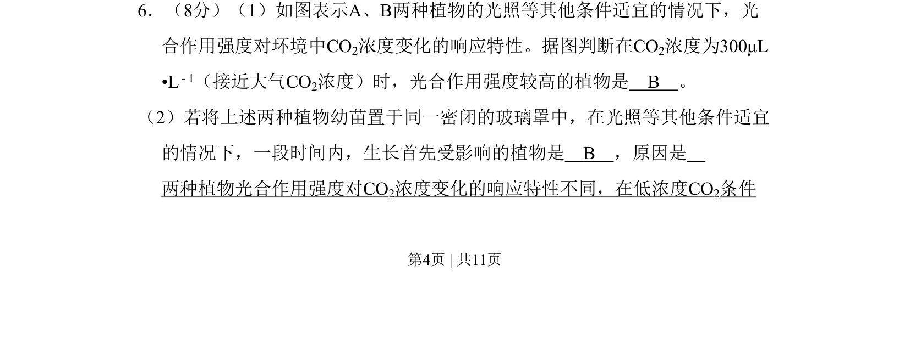
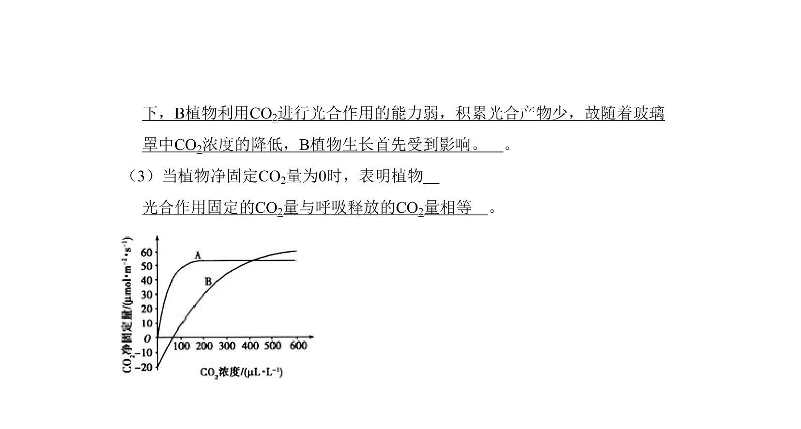
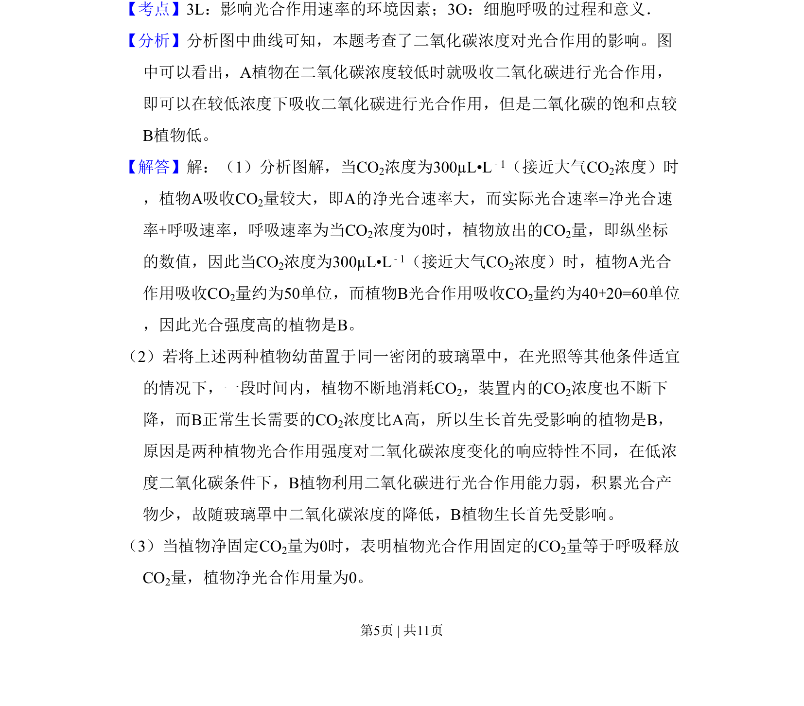
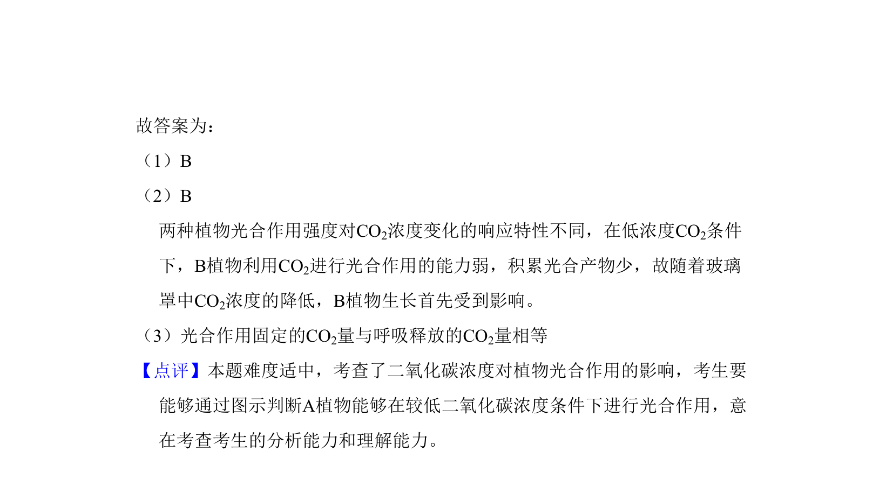

## 题面

## 摘要

比较不同植物光合作用强度对CO2浓度变化的响应特性

## 关联考点

- [[543-光合作用强度|光合作用强度]]
- [[523-CO2浓度|CO2浓度]]
- [[787-响应特性|响应特性]]

## 答案与解析

> 📄 原 PDF 第 4 页：`素材/真题/吉林/2008-2024·（吉林）生物高考真题/2009年高考生物试卷（全国卷Ⅱ）（解析卷）.pdf`
