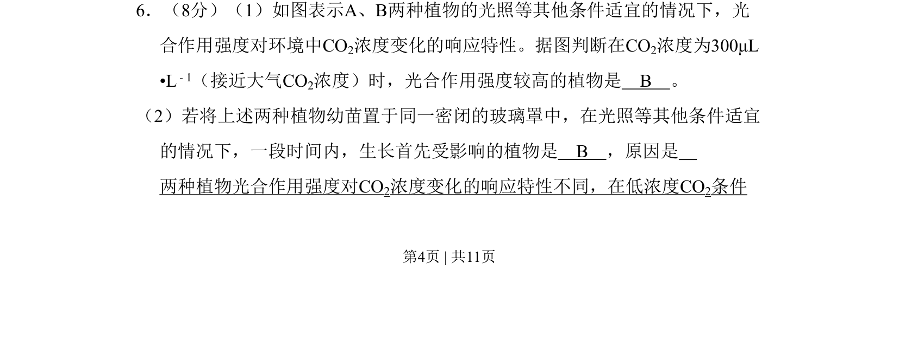
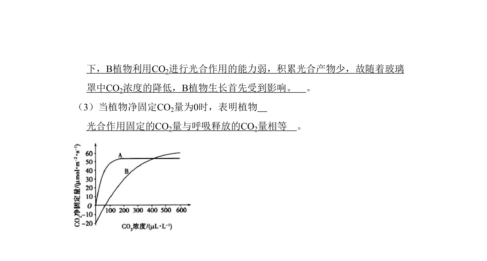
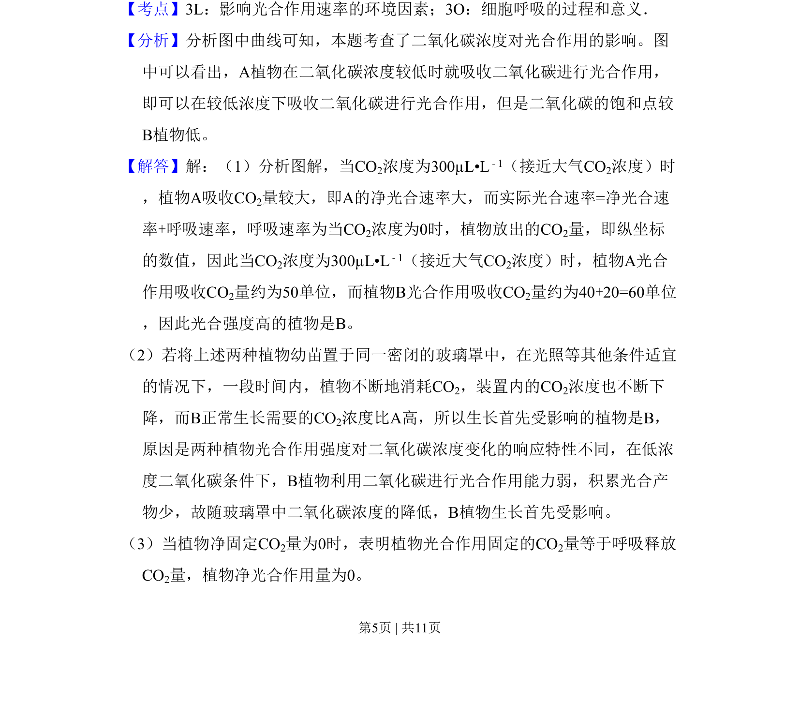
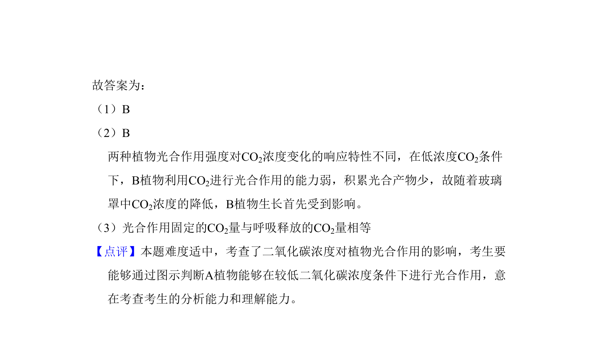

## 题面

## 摘要

比较不同植物光合作用强度对CO2浓度变化的响应特性

## 关联考点

- [[543-光合作用强度|光合作用强度]]
- [[523-CO2浓度|CO2浓度]]
- [[787-响应特性|响应特性]]

## 答案与解析

> 📄 原 PDF 第 4 页：`素材/真题/吉林/2008-2024·（吉林）生物高考真题/2009年高考生物试卷（全国卷Ⅱ）（解析卷）.pdf`

<!-- 题干文本-start -->
## 题干文本
6．（8分）（1）如图表示A、B两种植物的光照等其他条件适宜的情况下，光
合作用强度对环境中CO2浓度变化的响应特性。据图判断在CO2浓度为300μL
•L﹣1（接近大气CO2浓度）时，光合作用强度较高的植物是　B　。
（2）若将上述两种植物幼苗置于同一密闭的玻璃罩中，在光照等其他条件适宜
的情况下，一段时间内，生长首先受影响的植物是　B　，原因是　
两种植物光合作用强度对CO2浓度变化的响应特性不同，在低浓度CO2条件
<!-- 题干文本-end -->

<!-- 解析文本-start -->
## 解析文本

<!-- 解析文本-end -->
