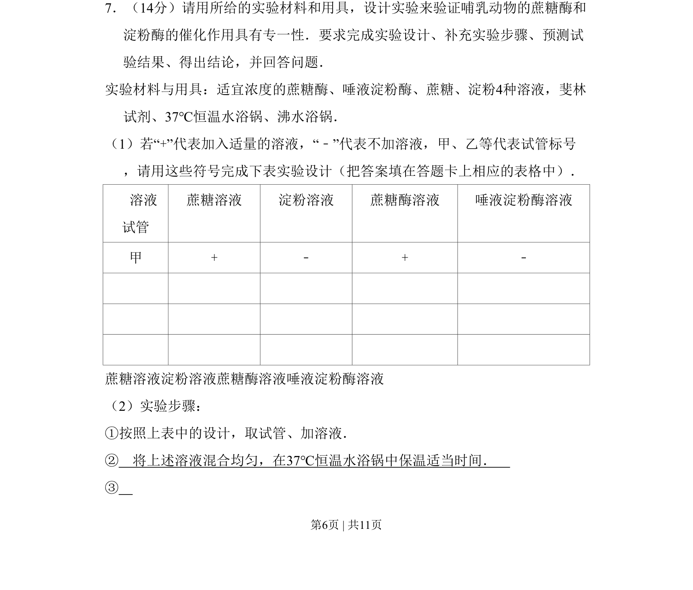
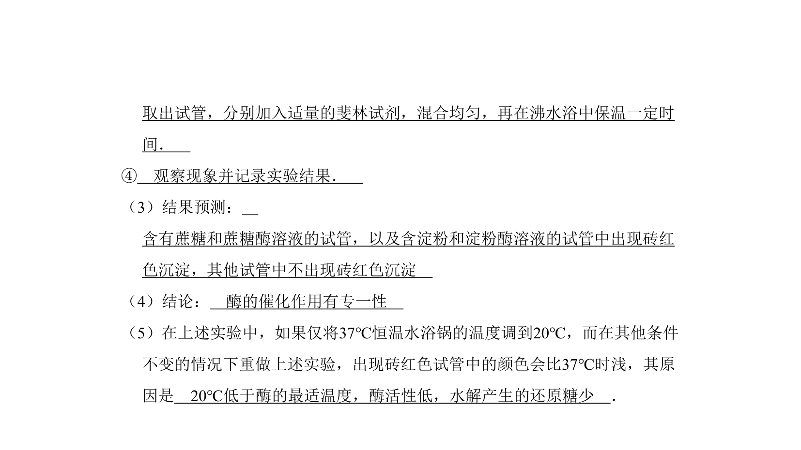
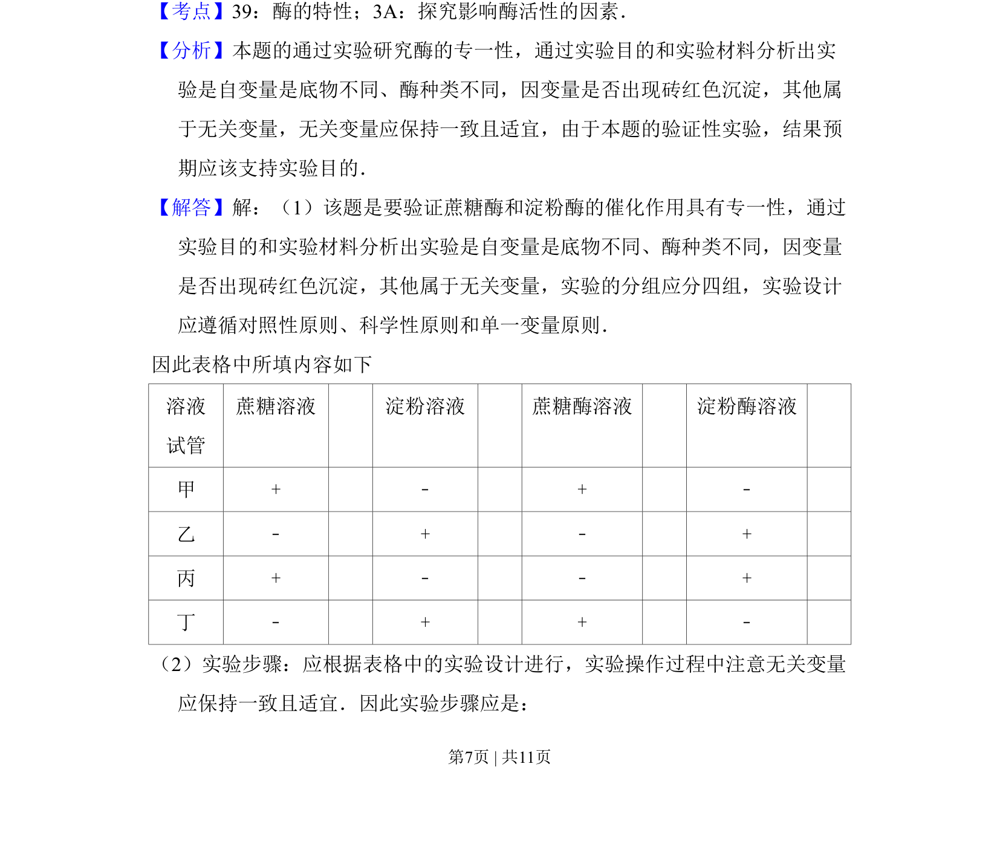
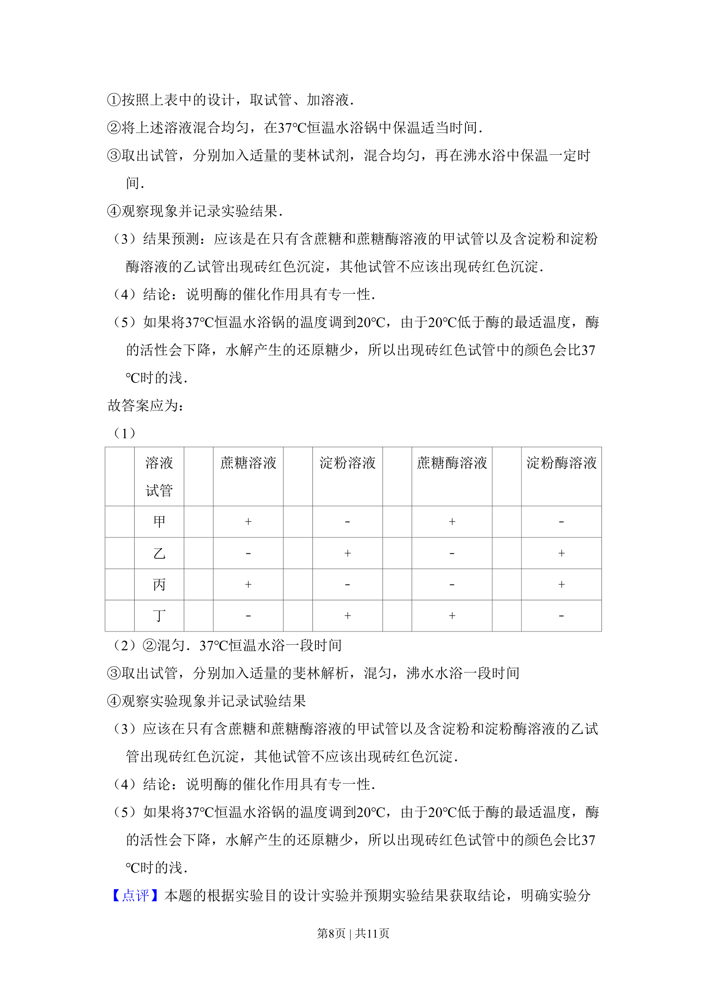
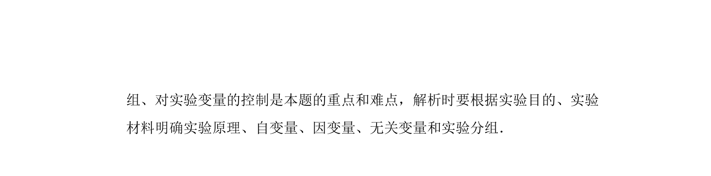

## 题面

## 摘要

该题考查验证酶专一性的实验设计、步骤补充及结果预测，涉及对照设置和斐林试剂使用。

## 关联考点

- [[482-实验设计|实验设计]]
- [[590-对照原则|对照原则]]
- [[878-酶的专一性|酶专一性]]
- [[773-还原糖检测|还原糖检测]]

## 答案与解析

> 📄 原 PDF 第 6 页：`素材/真题/吉林/2008-2024·（吉林）生物高考真题/2009年高考生物试卷（全国卷Ⅱ）（解析卷）.pdf`

<!-- 题干文本-start -->
## 题干文本
7．（14分）请用所给的实验材料和用具，设计实验来验证哺乳动物的蔗糖酶和
淀粉酶的催化作用具有专一性．要求完成实验设计、补充实验步骤、预测试
验结果、得出结论，并回答问题．
实验材料与用具：适宜浓度的蔗糖酶、唾液淀粉酶、蔗糖、淀粉4种溶液，斐林
试剂、37℃恒温水浴锅、沸水浴锅．
（1）若“+”代表加入适量的溶液，“﹣”代表不加溶液，甲、乙等代表试管标号
，请用这些符号完成下表实验设计（把答案填在答题卡上相应的表格中）．
     溶液
试管
蔗糖溶液 淀粉溶液 蔗糖酶溶液 唾液淀粉酶溶液
甲 + ﹣ + ﹣
蔗糖溶液淀粉溶液蔗糖酶溶液唾液淀粉酶溶液
（2）实验步骤：
①按照上表中的设计，取试管、加溶液．
②　将上述溶液混合均匀，在37℃恒温水浴锅中保温适当时间．　
③
<!-- 题干文本-end -->

<!-- 解析文本-start -->
## 解析文本

<!-- 解析文本-end -->
