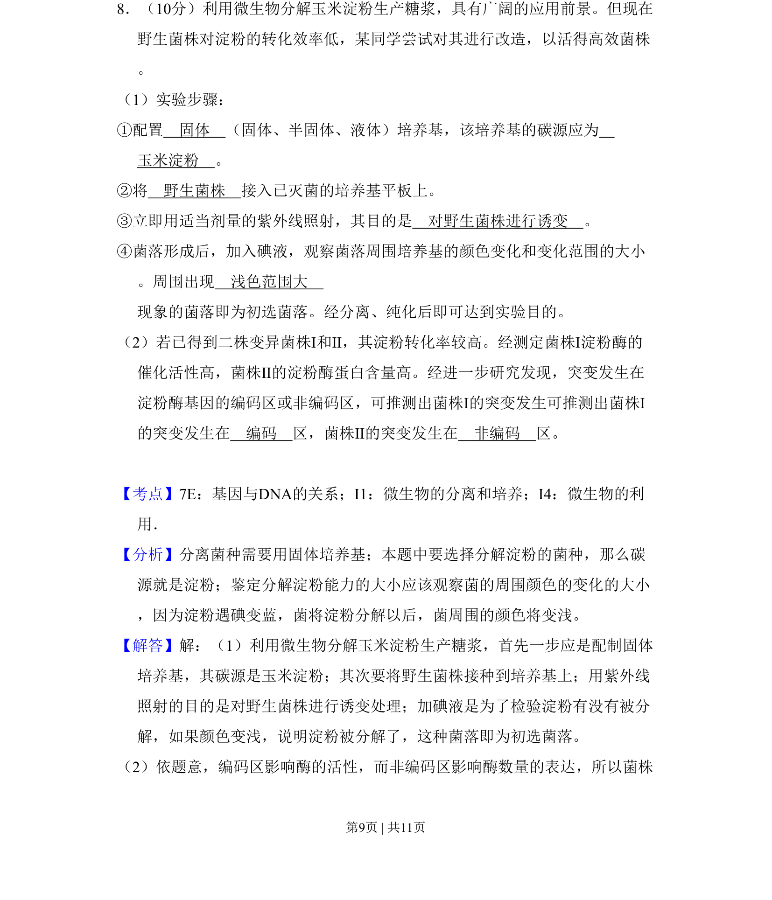
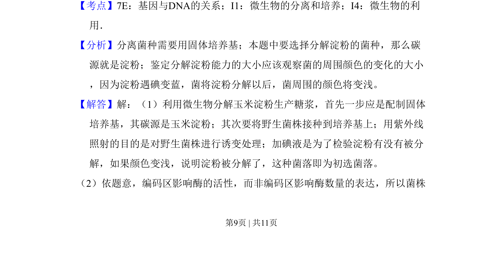
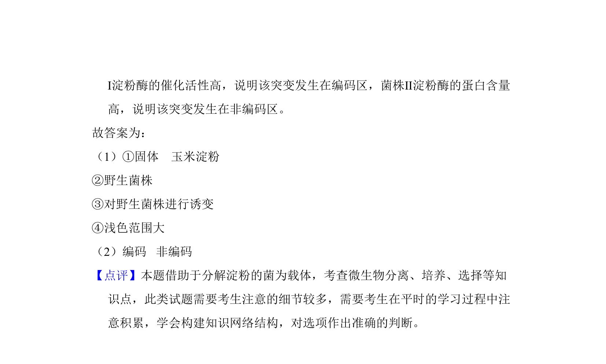

## 题面

## 摘要

考查微生物诱变育种及淀粉酶基因突变的分离与鉴定。

## 关联考点

- [[598-微生物分离培养|微生物分离培养]]
- [[709-诱变育种|诱变育种]]
- [[744-基因编码区与非编码区|基因编码区与非编码区]]

## 答案与解析

> 📄 原 PDF 第 9 页：`素材/真题/吉林/2008-2024·（吉林）生物高考真题/2009年高考生物试卷（全国卷Ⅱ）（解析卷）.pdf`

<!-- 题干文本-start -->
## 题干文本
8．（10分）利用微生物分解玉米淀粉生产糖浆，具有广阔的应用前景。但现在
野生菌株对淀粉的转化效率低，某同学尝试对其进行改造，以活得高效菌株
。
（1）实验步骤：
①配置　固体　（固体、半固体、液体）培养基，该培养基的碳源应为　
玉米淀粉　。
②将　野生菌株　接入已灭菌的培养基平板上。
③立即用适当剂量的紫外线照射，其目的是　对野生菌株进行诱变　。
④菌落形成后，加入碘液，观察菌落周围培养基的颜色变化和变化范围的大小
。周围出现　浅色范围大　
现象的菌落即为初选菌落。经分离、纯化后即可达到实验目的。
（2）若已得到二株变异菌株Ⅰ和Ⅱ，其淀粉转化率较高。经测定菌株Ⅰ淀粉酶的
催化活性高，菌株Ⅱ的淀粉酶蛋白含量高。经进一步研究发现，突变发生在
淀粉酶基因的编码区或非编码区，可推测出菌株Ⅰ的突变发生可推测出菌株Ⅰ
的突变发生在　编码　区，菌株Ⅱ的突变发生在　非编码　区。
<!-- 题干文本-end -->

<!-- 解析文本-start -->
## 解析文本
【考点】7E：基因与DNA的关系；I1：微生物的分离和培养；I4：微生物的利
用．菁优网版权所有
【分析】分离菌种需要用固体培养基；本题中要选择分解淀粉的菌种，那么碳
源就是淀粉；鉴定分解淀粉能力的大小应该观察菌的周围颜色的变化的大小
，因为淀粉遇碘变蓝，菌将淀粉分解以后，菌周围的颜色将变浅。
【解答】解：（1）利用微生物分解玉米淀粉生产糖浆，首先一步应是配制固体
培养基，其碳源是玉米淀粉；其次要将野生菌株接种到培养基上；用紫外线
照射的目的是对野生菌株进行诱变处理；加碘液是为了检验淀粉有没有被分
解，如果颜色变浅，说明淀粉被分解了，这种菌落即为初选菌落。
（2）依题意，编码区影响酶的活性，而非编码区影响酶数量的表达，所以菌株
<!-- 解析文本-end -->
