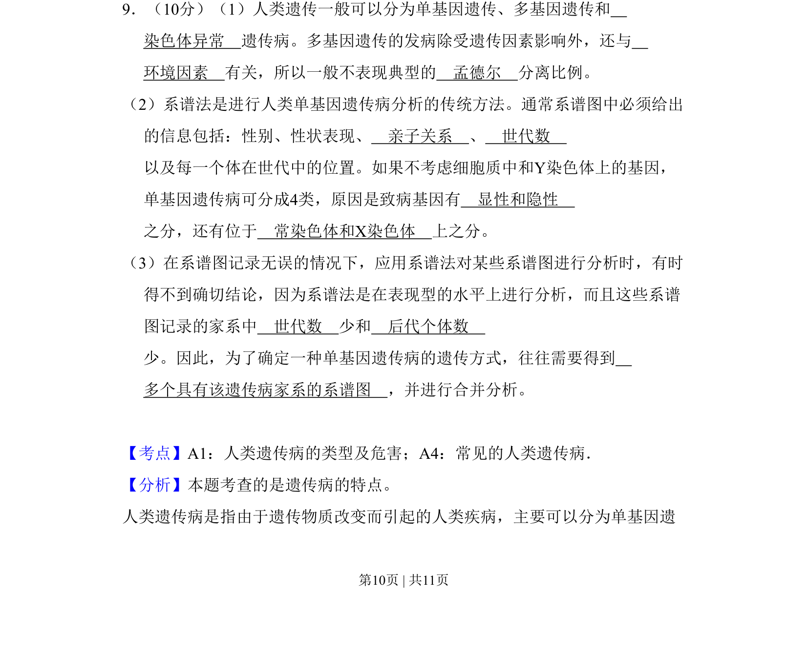

## 题面

## 摘要

本题主要考查人类遗传病的类型、特点及系谱分析法，要求理解多基因遗传与环境因素的关系以及单基因遗传病的分类依据。

## 关联考点

- [[人类遗传病类型]]
- [[系谱分析]]
- [[遗传方式判断]]

## 答案与解析

> 📄 原 PDF 第 10 页：`素材/真题/吉林/2008-2024·（吉林）生物高考真题/2009年高考生物试卷（全国卷Ⅱ）（解析卷）.pdf`
