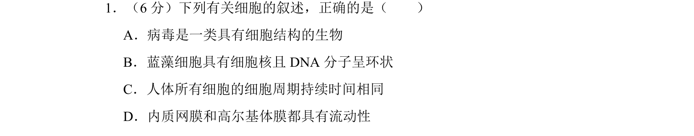
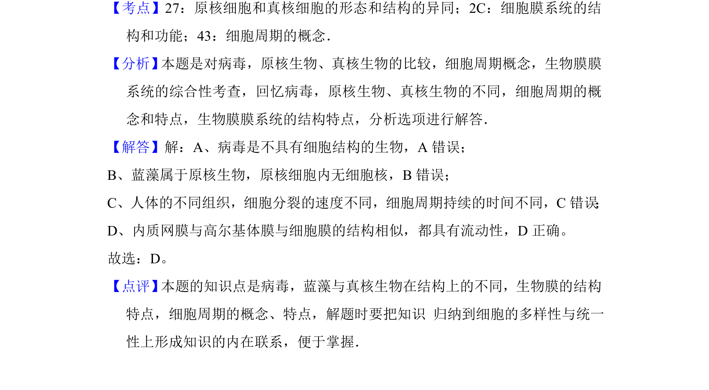

## 题面

## 摘要

本题通过辨析病毒、蓝藻、细胞周期和生物膜等结构，考查细胞结构与功能的基础知识。

## 关联考点

- [[122-病毒|病毒]]
- [[205-原核细胞|原核细胞]]
- [[252-细胞周期|细胞周期]]
- [[642-生物膜流动性|生物膜流动性]]

## 答案与解析

> 📄 原 PDF 第 6 页：`素材/真题/吉林/2008-2024·（吉林）生物高考真题/2010年高考生物试卷（新课标）（解析卷）.pdf`

<!-- 题干文本-start -->
## 题干文本
1．（6分）下列有关细胞的叙述，正确的是（　　）
A．病毒是一类具有细胞结构的生物
B．蓝藻细胞具有细胞核且DNA分子呈环状
C．人体所有细胞的细胞周期持续时间相同
D．内质网膜和高尔基体膜都具有流动性
<!-- 题干文本-end -->

<!-- 解析文本-start -->
## 解析文本
【考点】27：原核细胞和真核细胞的形态和结构的异同；2C：细胞膜系统的结
构和功能；43：细胞周期的概念．菁优网版权所有
【分析】 本题是对病毒，原核生物、真核生物的比较，细胞周期概念，生物膜膜
系统的综合性考查，回忆病毒，原核生物、真核生物的不同，细胞周期的概
念和特点，生物膜膜系统的结构特点，分析选项进行解答．
【解答】解：A、病毒是不具有细胞结构的生物，A错误；
B、蓝藻属于原核生物，原核细胞内无细胞核，B错误；
C、人体的不同组织，细胞分裂的速度不同，细胞周期持续的时间不同，C错误 ；
D、内质网膜与高尔基体膜与细胞膜的结构相似，都具有流动性，D正确。
故选：D。
【点评】 本题的知识点是病毒，蓝藻与真核生物在结构上的不同，生物膜的结构
特点，细胞周期的概念、特点，解题时要把知识 归纳到细胞的多样性与统一
性上形成知识的内在联系，便于掌握．
<!-- 解析文本-end -->
