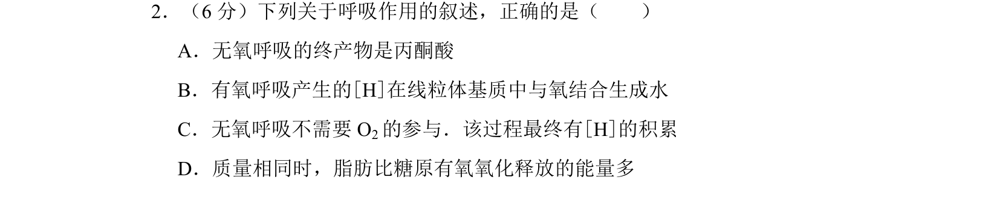

## 题面

## 摘要

本题考查呼吸作用的过程及物质能量变化，比较有氧呼吸与无氧呼吸的产物和能量释放特点。

## 关联考点

- [[无氧呼吸终产物]]
- [[有氧呼吸[H]反应场所]]
- [[脂肪与糖原氧化释能比较]]

## 答案与解析

> 📄 原 PDF 第 1 页：`素材/真题/吉林/2008-2024·（吉林）生物高考真题/2010年高考生物试卷（新课标）（解析卷）.pdf`
