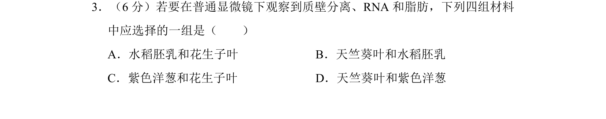
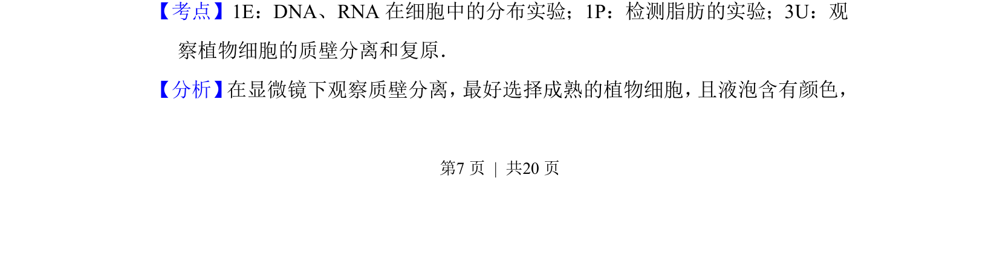
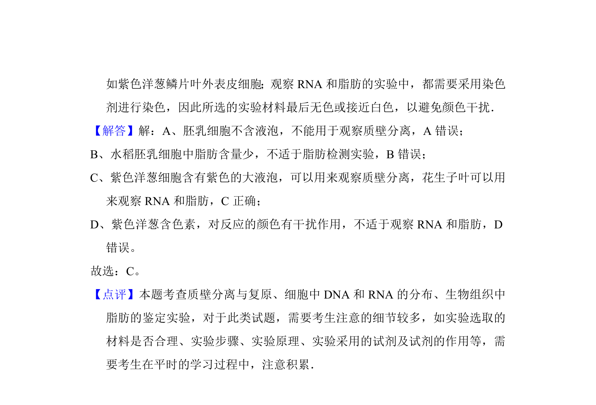

## 题面

## 摘要

考查质壁分离、RNA和脂肪的观察实验中材料选择。

## 关联考点

- [[262-质壁分离|质壁分离]]
- [[464-RNA|RNA]]
- [[132-脂肪|脂肪]]
- [[481-实验材料|实验材料]]

## 答案与解析

> 📄 原 PDF 第 7 页：`素材/真题/吉林/2008-2024·（吉林）生物高考真题/2010年高考生物试卷（新课标）（解析卷）.pdf`
