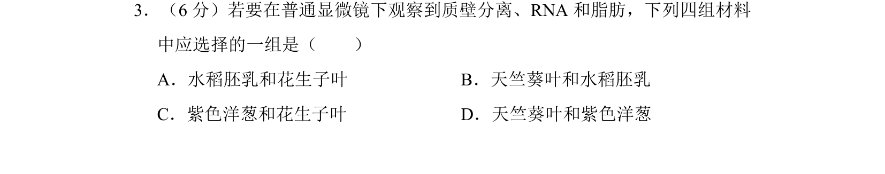
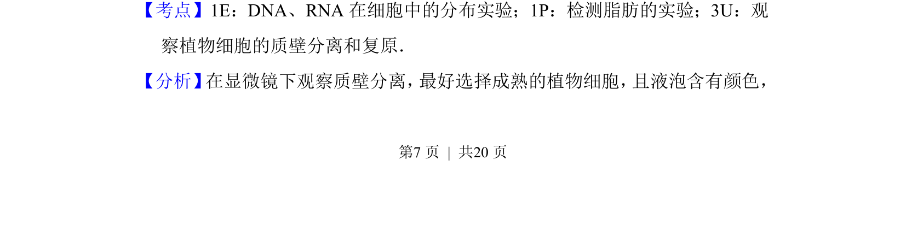
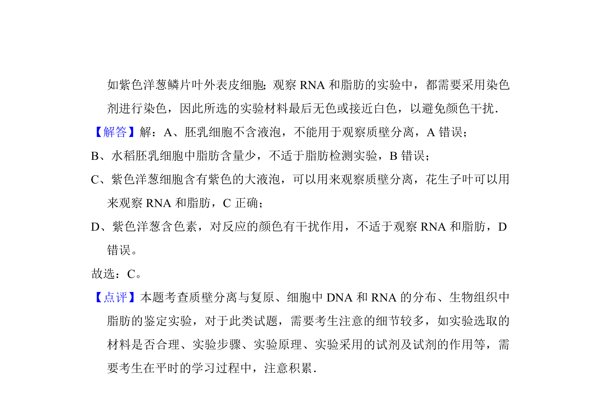

## 题面

## 摘要

考查质壁分离、RNA和脂肪的观察实验中材料选择。

## 关联考点

- [[262-质壁分离|质壁分离]]
- [[464-RNA|RNA]]
- [[132-脂肪|脂肪]]
- [[481-实验材料|实验材料]]

## 答案与解析

> 📄 原 PDF 第 7 页：`素材/真题/吉林/2008-2024·（吉林）生物高考真题/2010年高考生物试卷（新课标）（解析卷）.pdf`

<!-- 题干文本-start -->
## 题干文本
3．（6分）若要在普通显微镜下观察到质壁分离、RNA和脂肪，下列四组材料
中应选择的一组是（　　）
A．水稻胚乳和花生子叶B．天竺葵叶和水稻胚乳
C．紫色洋葱和花生子叶D．天竺葵叶和紫色洋葱
<!-- 题干文本-end -->

<!-- 解析文本-start -->
## 解析文本
【考点】1E：DNA、RNA在细胞中的分布实验；1P：检测脂肪的实验；3U：观
察植物细胞的质壁分离和复原．菁优网版权所有
【分析】 在显微镜下观察质壁分离， 最好选择成熟的植物细胞， 且液泡含有颜色，
<!-- 解析文本-end -->
