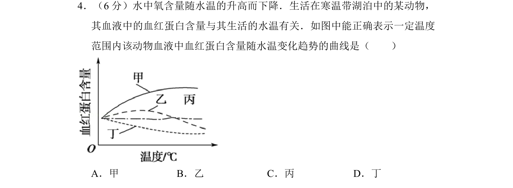
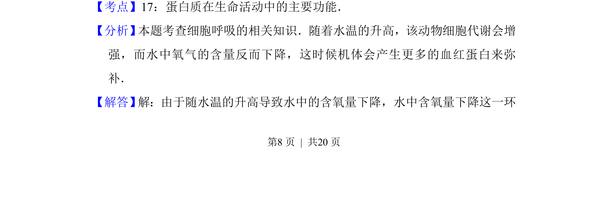
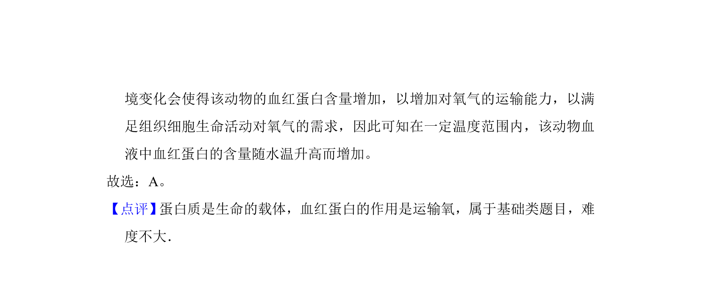

## 题面

## 摘要

该题考查水温升高导致溶氧量下降时，寒温带动物血红蛋白含量的适应性变化趋势。

## 关联考点

- [[703-血红蛋白|血红蛋白]]
- [[770-溶氧量|溶氧量]]
- [[035-温度|温度]]
- [[713-适应性|适应性]]

## 答案与解析

> 📄 原 PDF 第 8 页：`素材/真题/吉林/2008-2024·（吉林）生物高考真题/2010年高考生物试卷（新课标）（解析卷）.pdf`

<!-- 题干文本-start -->
## 题干文本
4．（6分）水中氧含量随水温的升高而下降．生活在寒温带湖泊中的某动物，
其血液中的血红蛋白含量与其生活的水温有关．如图中能正确表示一定温度
范围内该动物血液中血红蛋白含量随水温变化趋势的曲线是（　　）
A．甲B．乙C．丙D．丁
<!-- 题干文本-end -->

<!-- 解析文本-start -->
## 解析文本
【考点】17：蛋白质在生命活动中的主要功能．菁优网版权所有
【分析】 本题考查细胞呼吸的相关知识．随着水温的升高，该动物细胞代谢会增
强，而水中氧气的含量反而下降，这时候机体会产生更多的血红蛋白来弥
补．
【解答】 解：由于随水温的升高导致水中的含氧量下降，水中含氧量下降这一环
<!-- 解析文本-end -->
