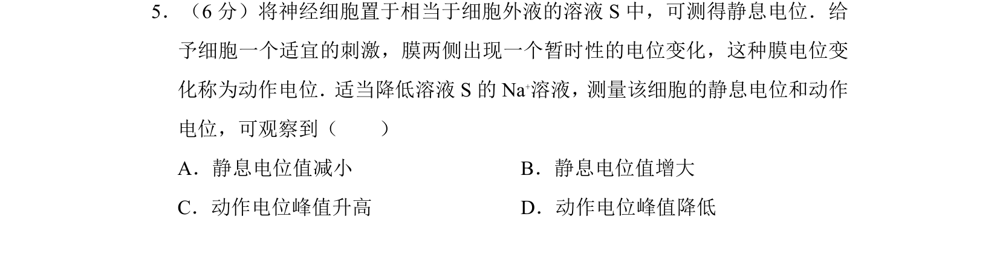
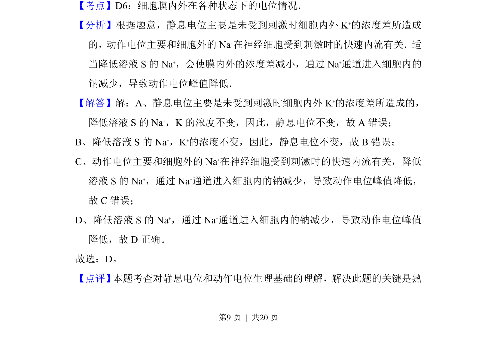

## 题面

## 摘要

该题考查神经细胞静息电位与动作电位的产生机制，以及降低细胞外液Na⁺浓度对电位的影响。

## 关联考点

- [[329-静息电位|静息电位]]
- [[318-动作电位|动作电位]]
- [[钠离子浓度]]
- [[细胞外液]]

## 答案与解析

> 📄 原 PDF 第 9 页：`素材/真题/吉林/2008-2024·（吉林）生物高考真题/2010年高考生物试卷（新课标）（解析卷）.pdf`
