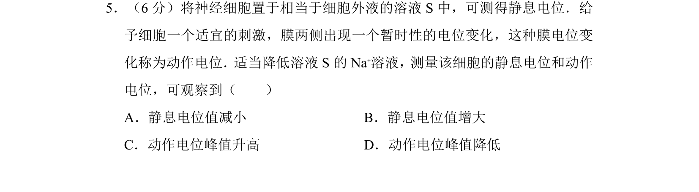
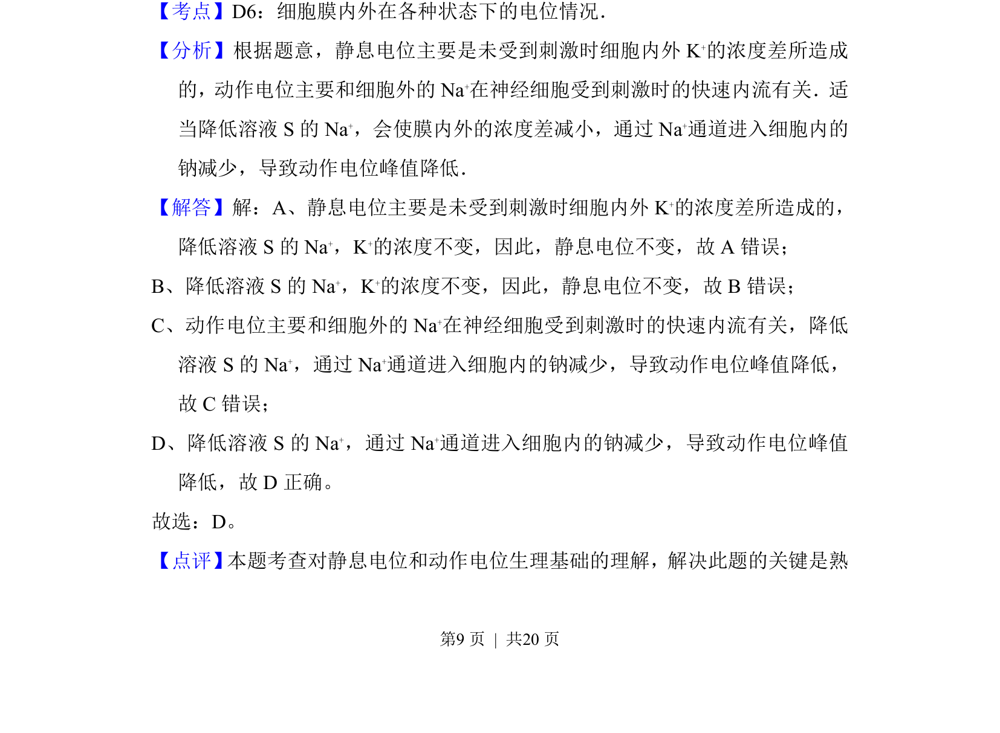

## 题面

## 摘要

该题考查神经细胞静息电位与动作电位的产生机制，以及降低细胞外液Na⁺浓度对电位的影响。

## 关联考点

- [[329-静息电位|静息电位]]
- [[318-动作电位|动作电位]]
- [[729-钠离子浓度|钠离子浓度]]
- [[788-细胞外液|细胞外液]]

## 答案与解析

> 📄 原 PDF 第 9 页：`素材/真题/吉林/2008-2024·（吉林）生物高考真题/2010年高考生物试卷（新课标）（解析卷）.pdf`

<!-- 题干文本-start -->
## 题干文本
5．（6分）将神经细胞置于相当于细胞外液的溶液S中，可测得静息电位．给
予细胞一个适宜的刺激，膜两侧出现一个暂时性的电位变化，这种膜电位变
化称为动作电位．适当降低溶液S的Na +溶液，测量该细胞的静息电位和动作
电位，可观察到（　　）
A．静息电位值减小B．静息电位值增大
C．动作电位峰值升高D．动作电位峰值降低
<!-- 题干文本-end -->

<!-- 解析文本-start -->
## 解析文本
【考点】D6：细胞膜内外在各种状态下的电位情况．菁优网版权所有
【分析】根据题意，静息电位主要是未受到刺激时细胞内外K +的浓度差所造成
的，动作电位主要和细胞外的Na+在神经细胞受到刺激时的快速内流有关．适
当降低溶液S的Na +，会使膜内外的浓度差减小，通过Na +通道进入细胞内的
钠减少，导致动作电位峰值降低．
【解答】解：A、静息电位主要是未受到刺激时细胞内外K +的浓度差所造成的，
降低溶液S的Na +，K+的浓度不变，因此，静息电位不变，故A错误；
B、降低溶液S的Na +，K+的浓度不变，因此，静息电位不变，故B错误；
C、动作电位主要和细胞外的Na +在神经细胞受到刺激时的快速内流有关，降低
溶液S的Na +，通过Na +通道进入细胞内的钠减少，导致动作电位峰值降低，
故C错误；
D、降低溶液S的Na +，通过Na +通道进入细胞内的钠减少，导致动作电位峰值
降低，故D正确。
故选：D。
【点评】 本题考查对静息电位和动作电位生理基础的理解，解决此题的关键是熟
<!-- 解析文本-end -->
