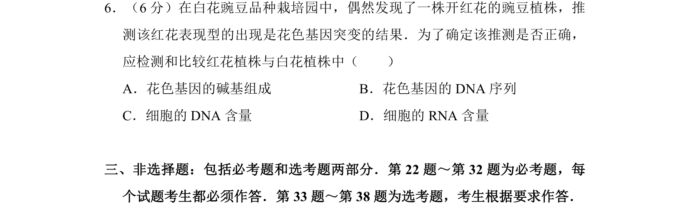
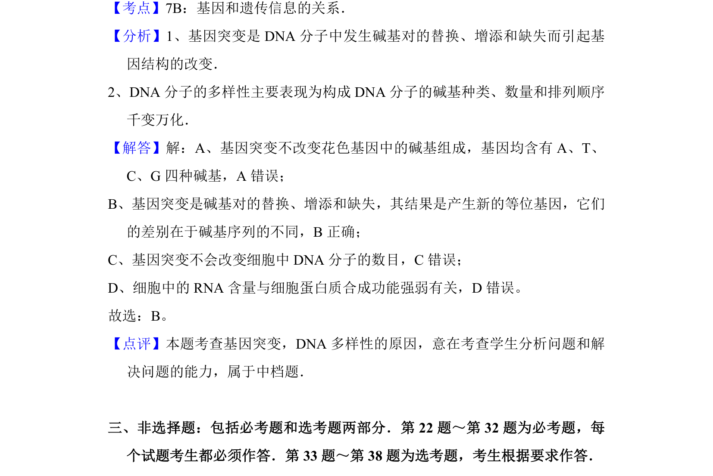

## 题面

## 摘要

本题通过红花突变推测，考查基因突变本质及DNA序列检测方法。

## 关联考点

- [[301-基因突变|基因突变]]
- [[462-DNA序列|DNA序列]]
- [[693-花色基因|花色基因]]

## 答案与解析

> 📄 原 PDF 第 10 页：`素材/真题/吉林/2008-2024·（吉林）生物高考真题/2010年高考生物试卷（新课标）（解析卷）.pdf`
