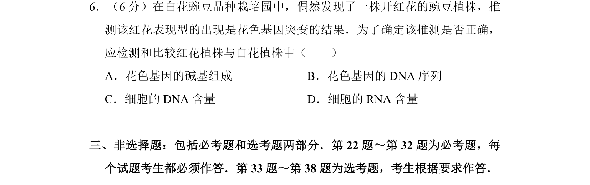
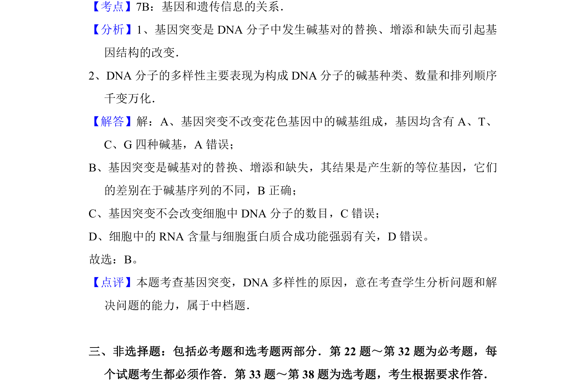

## 题面

## 摘要

本题通过红花突变推测，考查基因突变本质及DNA序列检测方法。

## 关联考点

- [[301-基因突变|基因突变]]
- [[462-DNA序列|DNA序列]]
- [[693-花色基因|花色基因]]

## 答案与解析

> 📄 原 PDF 第 10 页：`素材/真题/吉林/2008-2024·（吉林）生物高考真题/2010年高考生物试卷（新课标）（解析卷）.pdf`

<!-- 题干文本-start -->
## 题干文本
6．（6分）在白花豌豆品种栽培园中，偶然发现了一株开红花的豌豆植株，推
测该红花表现型的出现是花色基因突变的结果．为了确定该推测是否正确，
应检测和比较红花植株与白花植株中（　　）
A．花色基因的碱基组成B．花色基因的DNA序列
C．细胞的DNA含量D．细胞的RNA含量
<!-- 题干文本-end -->

<!-- 解析文本-start -->
## 解析文本
【考点】7B：基因和遗传信息的关系．菁优网版权所有
【分析】1、基因突变是DNA分子中发生碱基对的替换、增添和缺失而引起基
因结构的改变．
2、DNA分子的多样性主要表现为构成DNA分子的碱基种类、数量和排列顺序
千变万化．
【解答】解：A、基因突变不改变花色基因中的碱基组成，基因均含有A、T、
C、G四种碱基，A错误；
B、基因突变是碱基对的替换、增添和缺失，其结果是产生新的等位基因，它们
的差别在于碱基序列的不同，B正确；
C、基因突变不会改变细胞中DNA分子的数目，C错误；
D、细胞中的RNA含量与细胞蛋白质合成功能强弱有关，D错误。
故选：B。
【点评】本题考查基因突变，DNA多样性的原因，意在考查学生分析问题和解
决问题的能力，属于中档题．
　
三、非选择题：包括必考题和选考题两部分．第22题～第32题为必考题，每
个试题考生都必须作答．第33题～第38题为选考题，考生根据要求作答．
<!-- 解析文本-end -->
