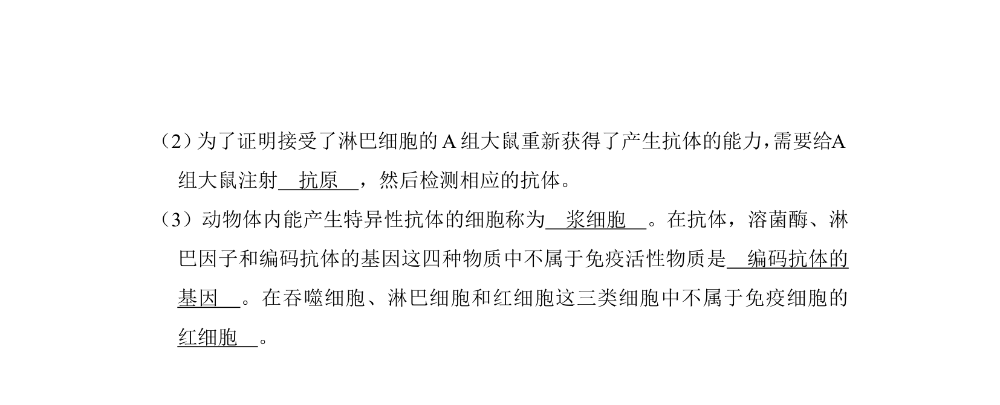
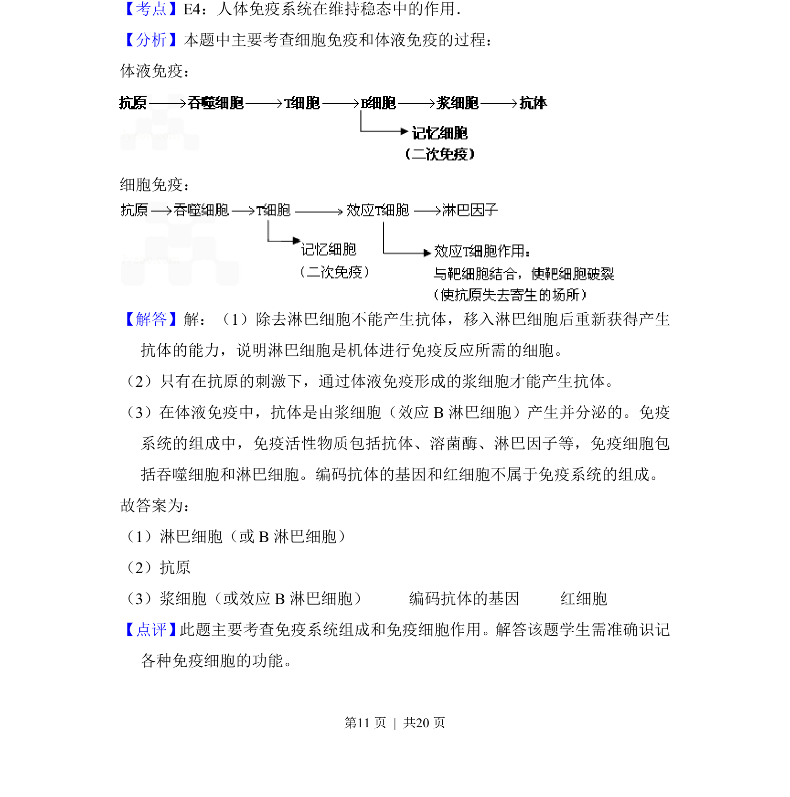

## 题面

## 摘要

该题通过大鼠淋巴细胞转移实验，考查免疫细胞功能、抗体产生及免疫活性物质的判断。

## 关联考点

- [[546-免疫反应|免疫反应]]
- [[637-特异性免疫|特异性免疫]]
- [[628-淋巴细胞|淋巴细胞]]
- [[548-免疫活性物质|免疫活性物质]]

## 答案与解析

> 📄 原 PDF 第 10 页：`素材/真题/吉林/2008-2024·（吉林）生物高考真题/2010年高考生物试卷（新课标）（解析卷）.pdf`
