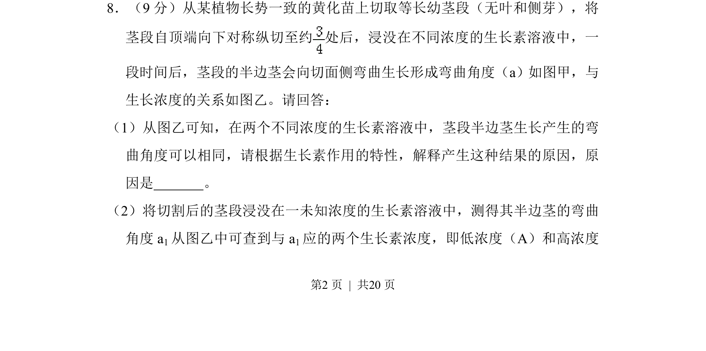
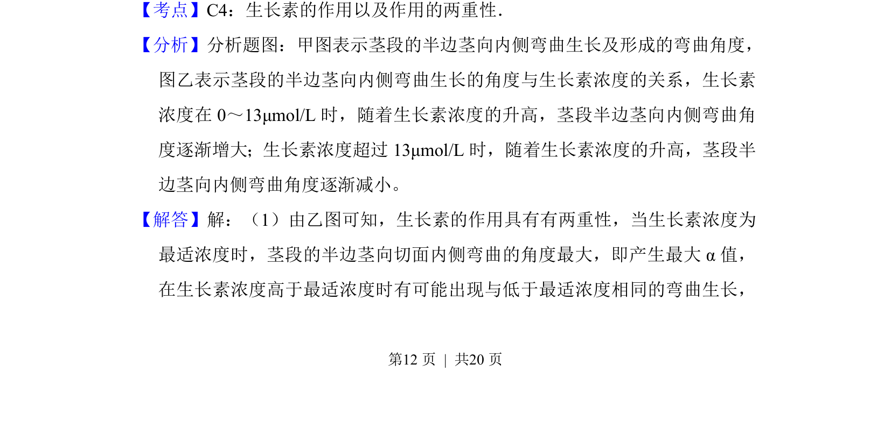
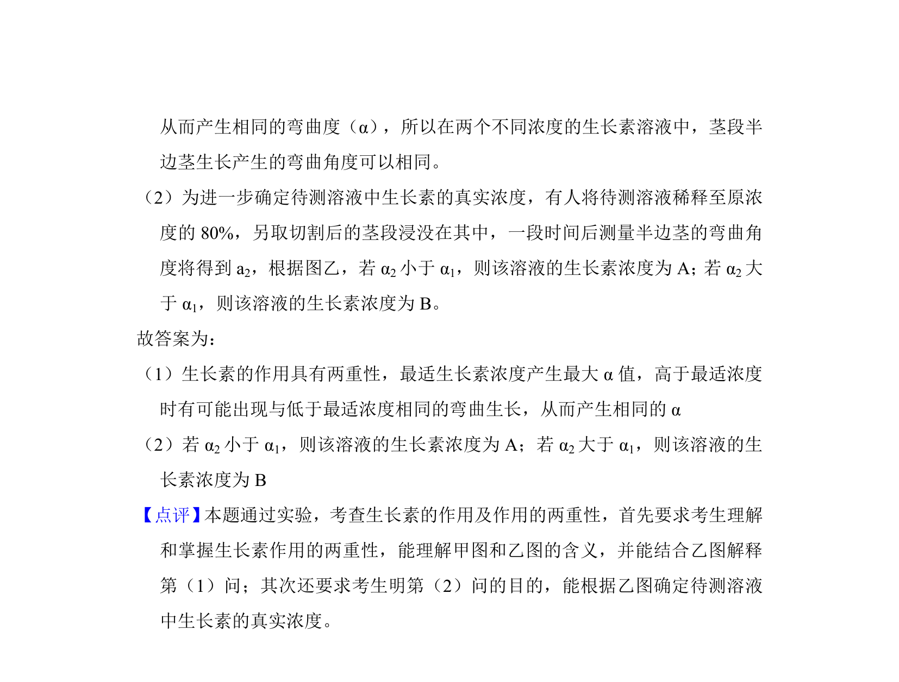

## 题面

## 摘要

本题通过茎段弯曲实验考查生长素的作用特性及其浓度效应，解释不同浓度产生相同弯曲角度的原因。

## 关联考点

- [[生长素两重性]]
- [[生长素浓度]]
- [[弯曲角度]]
- [[最适浓度]]

## 答案与解析

> 📄 原 PDF 第 12 页：`素材/真题/吉林/2008-2024·（吉林）生物高考真题/2010年高考生物试卷（新课标）（解析卷）.pdf`
