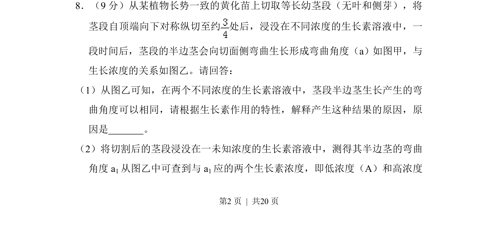
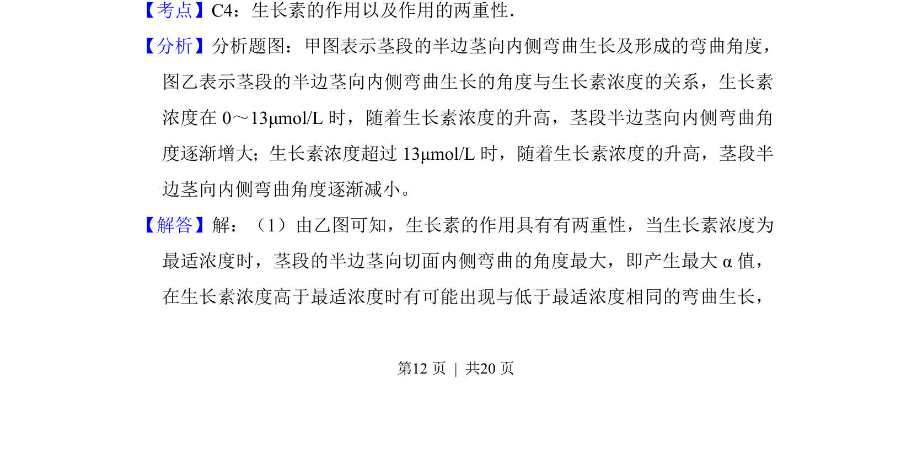
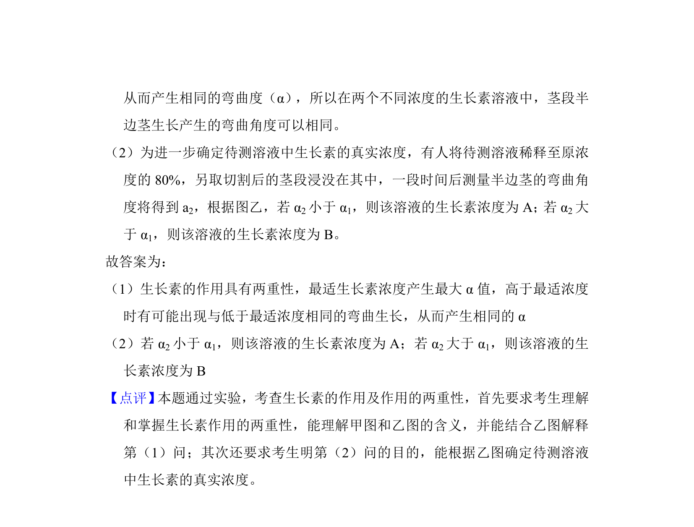

## 题面

## 摘要

本题通过茎段弯曲实验考查生长素的作用特性及其浓度效应，解释不同浓度产生相同弯曲角度的原因。

## 关联考点

- [[643-生长素两重性|生长素两重性]]
- [[644-生长素浓度|生长素浓度]]
- [[808-弯曲角度|弯曲角度]]
- [[612-最适浓度|最适浓度]]

## 答案与解析

> 📄 原 PDF 第 12 页：`素材/真题/吉林/2008-2024·（吉林）生物高考真题/2010年高考生物试卷（新课标）（解析卷）.pdf`

<!-- 题干文本-start -->
## 题干文本
8．（9分）从某植物长势一致的黄化苗上切取等长幼茎段（无叶和侧芽），将
茎段自顶端向下对称纵切至约 处后，浸没在不同浓度的生长素溶液中，一
段时间后，茎段的半边茎会向切面侧弯曲生长形成弯曲角度（a）如图甲，与
生长浓度的关系如图乙。请回答：
（1）从图乙可知，在两个不同浓度的生长素溶液中，茎段半边茎生长产生的弯
曲角度可以相同，请根据生长素作用的特性，解释产生这种结果的原因，原
因是　生长素的作用具有双重性，最适生长素浓度产生最大α值，高于最适
浓度时有可能出现与低于最适浓度相同的弯曲生长，从而产生相同的α　。
（2）将切割后的茎段浸没在一未知浓度的生长素溶液中，测得其半边茎的弯曲
角度a 1从图乙中可查到与a 1应的两个生长素浓度，即低浓度（A）和高浓度
（B）。为进一步确定待测溶液中生长素的真实浓度，有人将待测溶液稀释至
原浓度的80%，另取切割后的茎浸没在其中，一段时间后测量半边茎的弯曲
角度将得到a 2请预测a 2a1比较的可能结果，并得出相应的结论：　若α 2小于
α1， 则该溶液的生长素浓度为A； 若α2大于α 1， 则该溶液的生长素浓度为B　。
<!-- 题干文本-end -->

<!-- 解析文本-start -->
## 解析文本
【考点】C4：生长素的作用以及作用的两重性．菁优网版权所有
【分析】分析题图：甲图表示茎段的半边茎向内侧弯曲生长及形成的弯曲角度，
图乙表示茎段的半边茎向内侧弯曲生长的角度与生长素浓度的关系，生长素
浓度在0～13μmol/L时，随着生长素浓度的升高，茎段半边茎向内侧弯曲角
度逐渐增大；生长素浓度超过13μmol/L时，随着生长素浓度的升高，茎段半
边茎向内侧弯曲角度逐渐减小。
【解答】解：（1）由乙图可知，生长素的作用具有有两重性，当生长素浓度为
最适浓度时，茎段的半边茎向切面内侧弯曲的角度最大，即产生最大α值，
在生长素浓度高于最适浓度时有可能出现与低于最适浓度相同的弯曲生长，
<!-- 解析文本-end -->
