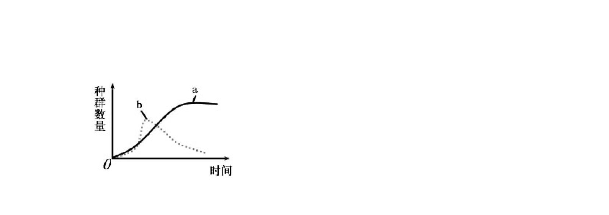
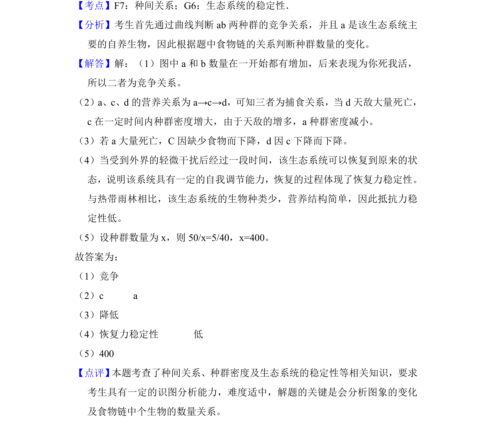

## 题面

## 摘要

考查生态系统中种间关系、食物链及种群密度变化，结合标记重捕法计算。

## 关联考点

- [[022-生物因素|种间关系]]
- [[028-食物链|食物链]]
- [[370-种群密度|种群密度]]
- [[396-抵抗力稳定性|抵抗力稳定性]]
- [[782-标记重捕法|标记重捕法]]

## 答案与解析

> 📄 原 PDF 第 13 页：`素材/真题/吉林/2008-2024·（吉林）生物高考真题/2010年高考生物试卷（新课标）（解析卷）.pdf`
