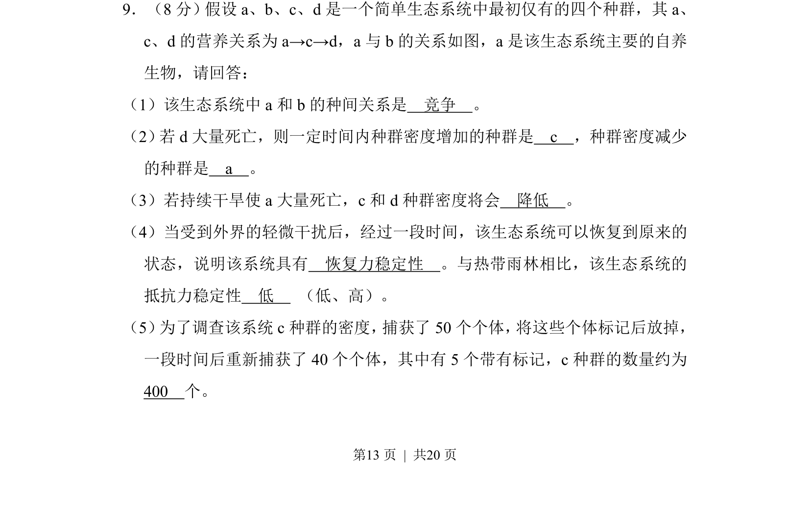
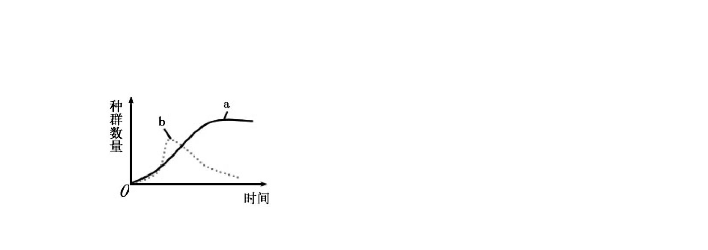
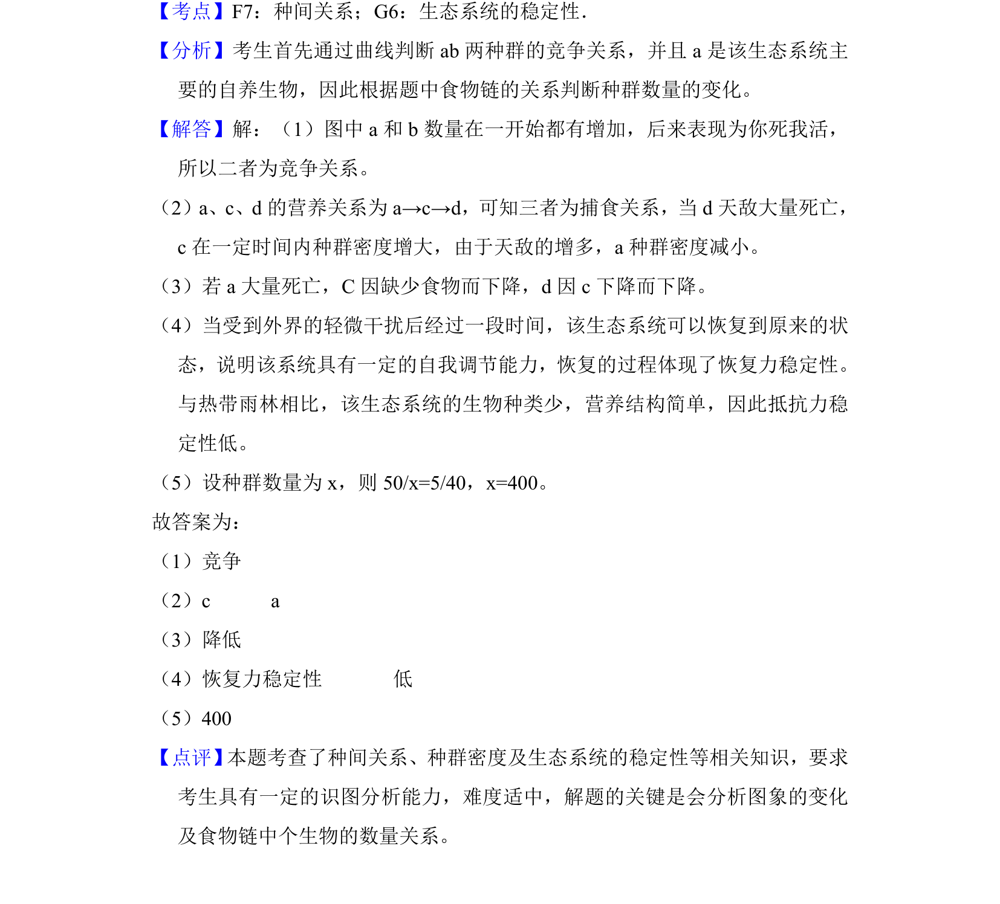

## 题面

## 摘要

考查生态系统中种间关系、食物链及种群密度变化，结合标记重捕法计算。

## 关联考点

- [[022-生物因素|种间关系]]
- [[028-食物链|食物链]]
- [[370-种群密度|种群密度]]
- [[396-抵抗力稳定性|抵抗力稳定性]]
- [[782-标记重捕法|标记重捕法]]

## 答案与解析

> 📄 原 PDF 第 13 页：`素材/真题/吉林/2008-2024·（吉林）生物高考真题/2010年高考生物试卷（新课标）（解析卷）.pdf`

<!-- 题干文本-start -->
## 题干文本
9．（8分）假设a、b、c、d是一个简单生态系统中最初仅有的四个种群，其a、
c、d的营养关系为a→c→d，a与b的关系如图，a是该生态系统主要的自养
生物，请回答：
（1）该生态系统中a和b的种间关系是　竞争　。
（2） 若d大量死亡，则一定时间内种群密度增加的种群是　c　，种群密度减少
的种群是　a　。
（3）若持续干旱使a大量死亡，c和d种群密度将会　降低　。
（4）当受到外界的轻微干扰后，经过一段时间，该生态系统可以恢复到原来的
状态，说明该系统具有　恢复力稳定性　。与热带雨林相比，该生态系统的
抵抗力稳定性　低　 （低、高）。    
（5） 为了调查该系统c种群的密度， 捕获了50个个体， 将这些个体标记后放掉，
一段时间后重新捕获了40个个体，其中有5个带有标记，c种群的数量约为　
400　个。
<!-- 题干文本-end -->

<!-- 解析文本-start -->
## 解析文本

<!-- 解析文本-end -->
