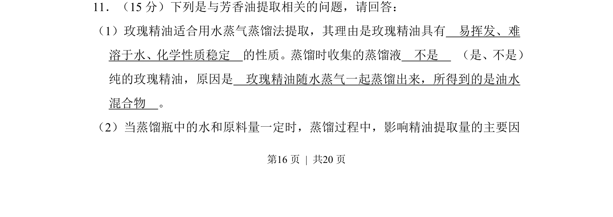
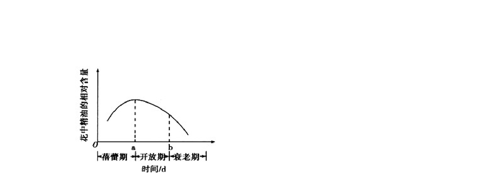
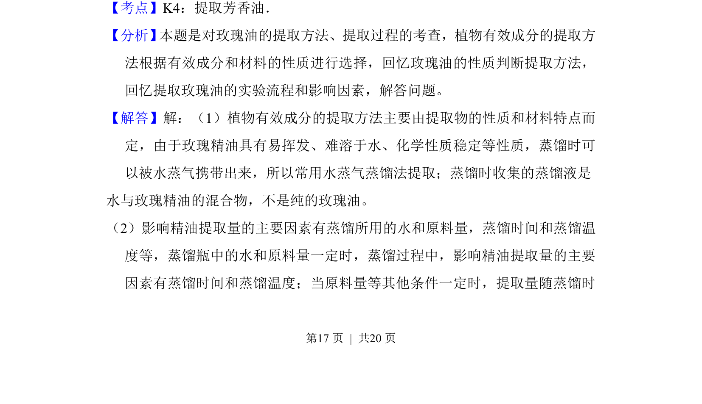
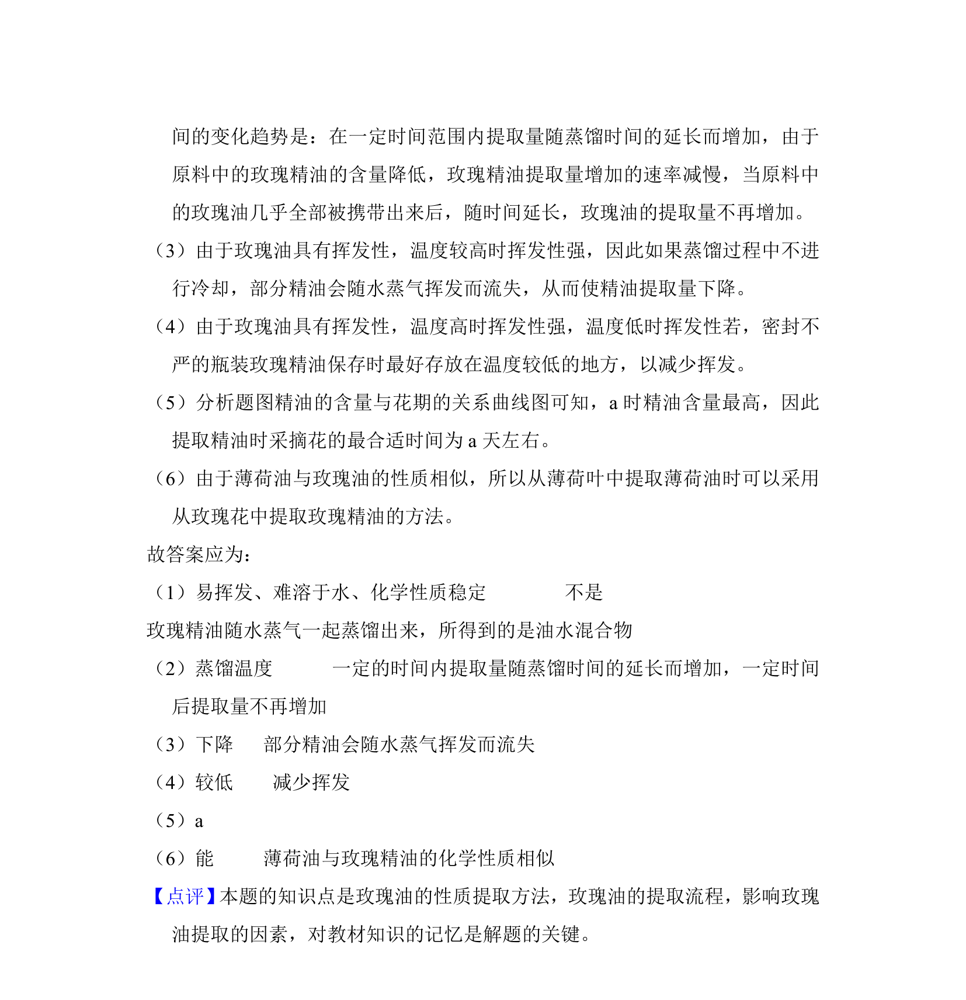

## 题面

## 摘要

该题考查水蒸气蒸馏法提取植物精油的原理、操作影响因素及保存条件。

## 关联考点

- [[759-水蒸气蒸馏|水蒸气蒸馏]]
- [[775-精油提取|精油提取]]
- [[596-影响提取量因素|影响提取量因素]]

## 答案与解析

> 📄 原 PDF 第 16 页：`素材/真题/吉林/2008-2024·（吉林）生物高考真题/2010年高考生物试卷（新课标）（解析卷）.pdf`

<!-- 题干文本-start -->
## 题干文本
11．（15分）下列是与芳香油提取相关的问题，请回答：
（1）玫瑰精油适合用水蒸气蒸馏法提取，其理由是玫瑰精油具有　易挥发、难
溶于水、化学性质稳定　的性质。蒸馏时收集的蒸馏液　不是　 （是、不是）
纯的玫瑰精油，原因是　玫瑰精油随水蒸气一起蒸馏出来，所得到的是油水
混合物　。
（2）当蒸馏瓶中的水和原料量一定时，蒸馏过程中，影响精油提取量的主要因
<!-- 题干文本-end -->

<!-- 解析文本-start -->
## 解析文本

<!-- 解析文本-end -->
