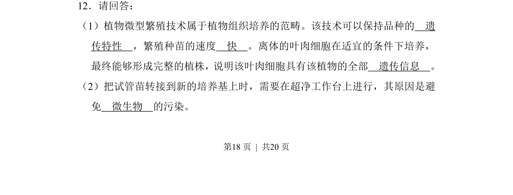
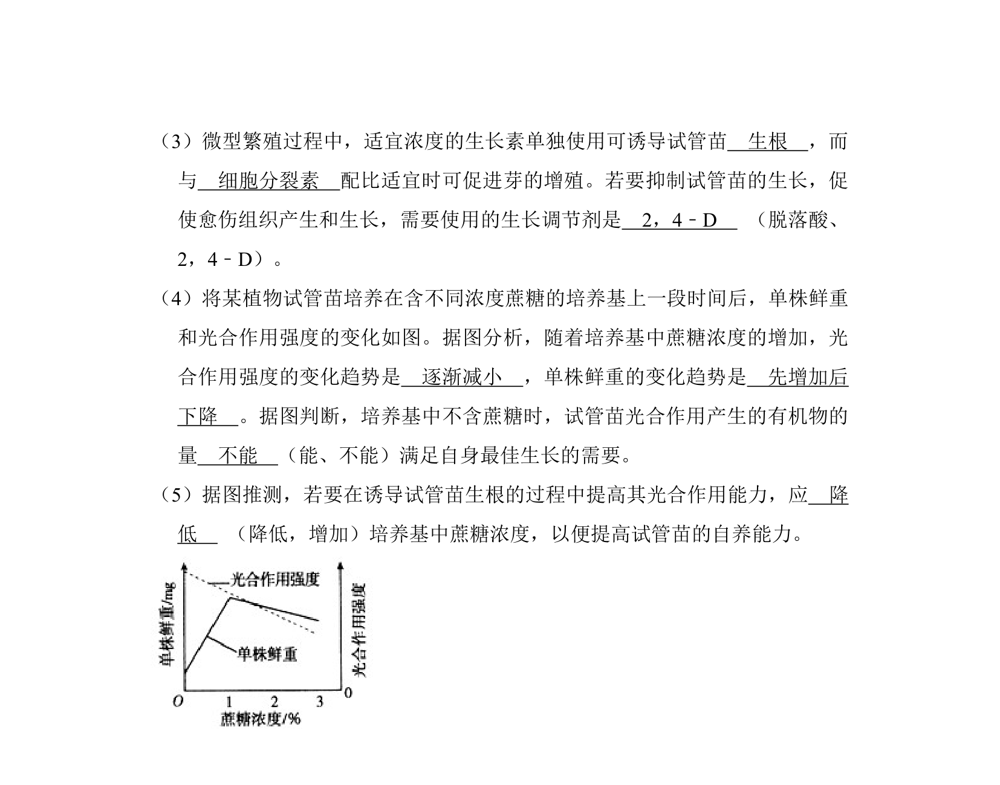
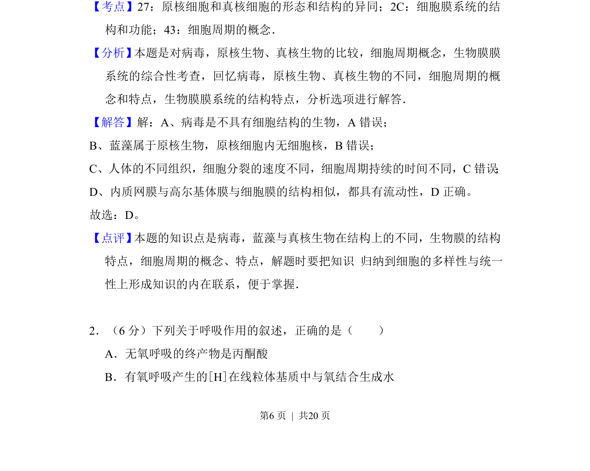
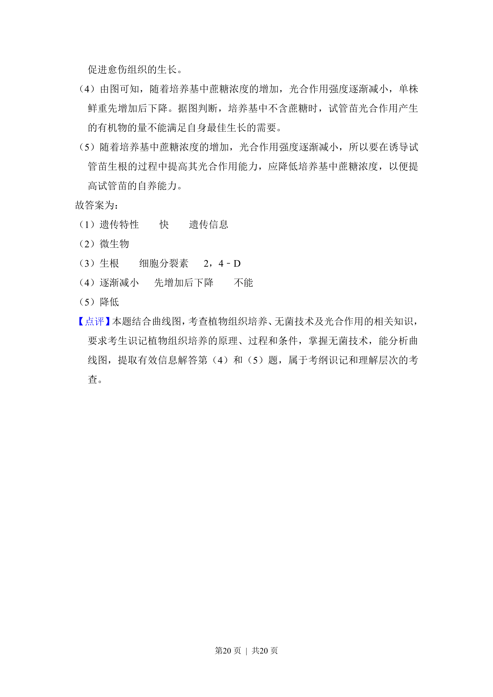

## 题面

## 摘要

考查植物微型繁殖原理、操作条件、激素调节及蔗糖浓度对光合作用与生长的影响

## 关联考点

- [[437-植物组织培养|植物组织培养]]
- [[597-微型繁殖|微型繁殖]]
- [[033-光合作用|光合作用]]
- [[495-植物生长调节剂|植物生长调节剂]]

## 答案与解析

> 📄 原 PDF 第 18 页：`素材/真题/吉林/2008-2024·（吉林）生物高考真题/2010年高考生物试卷（新课标）（解析卷）.pdf`

<!-- 题干文本-start -->
## 题干文本
12．请回答：
（1）植物微型繁殖技术属于植物组织培养的范畴。该技术可以保持品种的　遗
传特性　，繁殖种苗的速度　快　。离体的叶肉细胞在适宜的条件下培养，
最终能够形成完整的植株，说明该叶肉细胞具有该植物的全部　遗传信息　。
（2）把试管苗转接到新的培养基上时，需要在超净工作台上进行，其原因是避
免　微生物　的污染。
<!-- 题干文本-end -->

<!-- 解析文本-start -->
## 解析文本

<!-- 解析文本-end -->
