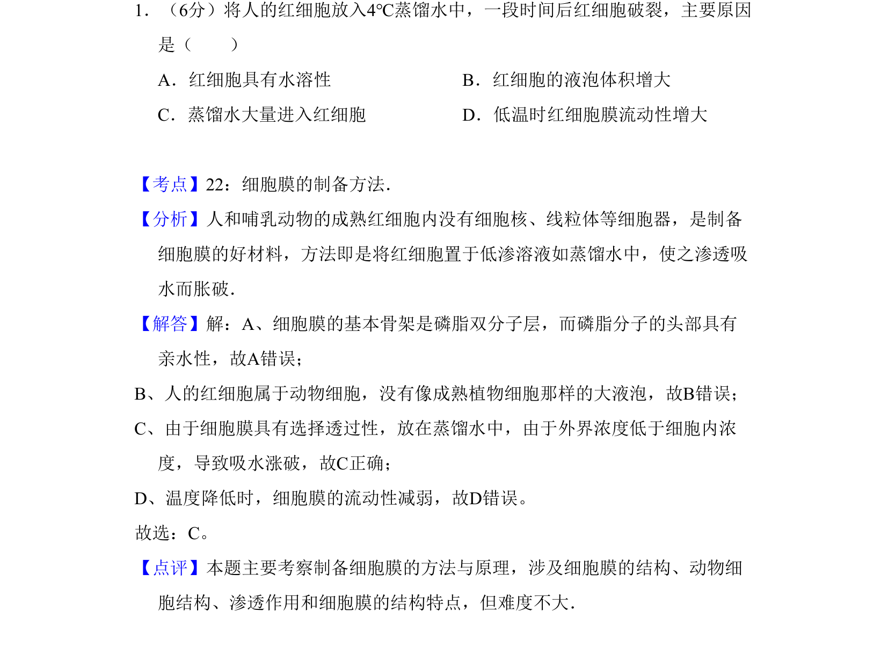
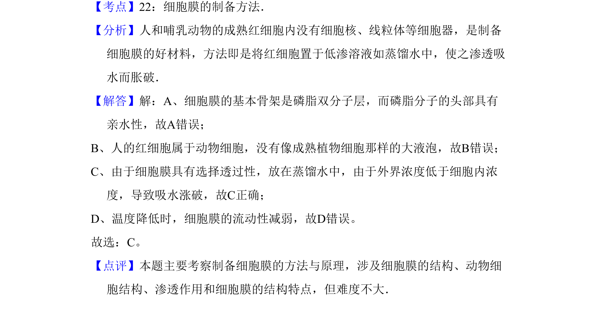

## 题面

## 摘要

该题考查细胞膜制备方法及渗透吸水原理，涉及细胞结构与功能。

## 关联考点

- [[683-细胞膜结构|细胞膜结构]]
- [[258-渗透作用|渗透作用]]
- [[557-动物细胞结构|动物细胞结构]]

## 答案与解析

> 📄 原 PDF 第 1 页：`素材/真题/吉林/2008-2024·（吉林）生物高考真题/2011年高考生物试卷（新课标）（解析卷）.pdf`
