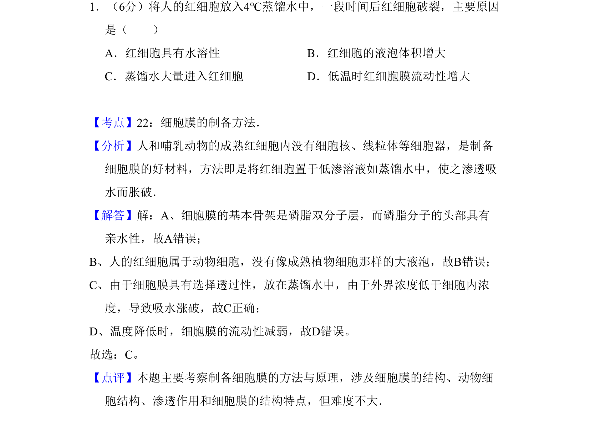
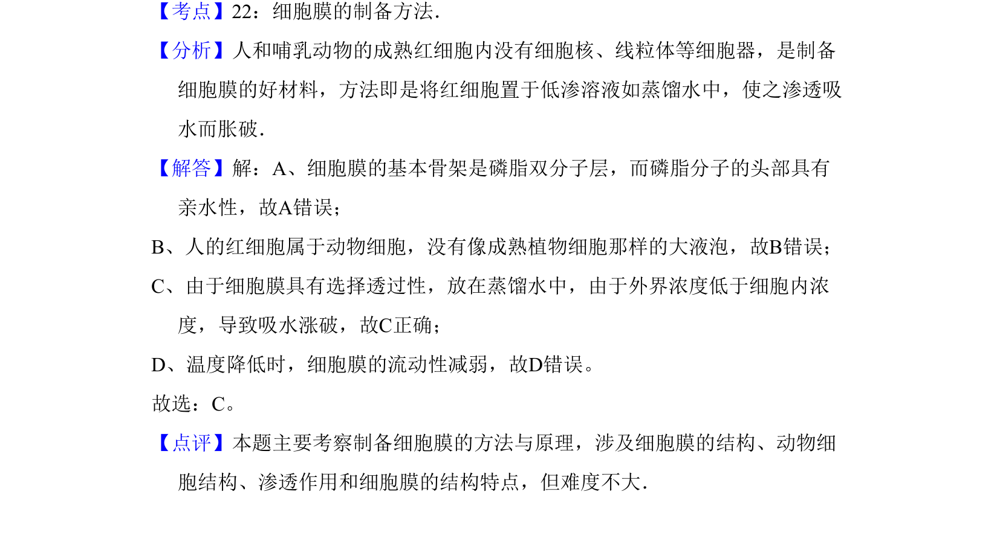

## 题面

## 摘要

该题考查细胞膜制备方法及渗透吸水原理，涉及细胞结构与功能。

## 关联考点

- [[683-细胞膜结构|细胞膜结构]]
- [[258-渗透作用|渗透作用]]
- [[557-动物细胞结构|动物细胞结构]]

## 答案与解析

> 📄 原 PDF 第 1 页：`素材/真题/吉林/2008-2024·（吉林）生物高考真题/2011年高考生物试卷（新课标）（解析卷）.pdf`

<!-- 题干文本-start -->
## 题干文本
1．（6分）将人的红细胞放入4℃蒸馏水中，一段时间后红细胞破裂，主要原因
是（　　）
A．红细胞具有水溶性B．红细胞的液泡体积增大
C．蒸馏水大量进入红细胞D．低温时红细胞膜流动性增大
<!-- 题干文本-end -->

<!-- 解析文本-start -->
## 解析文本
【考点】22：细胞膜的制备方法．菁优网版权所有
【分析】人和哺乳动物的成熟红细胞内没有细胞核、线粒体等细胞器，是制备
细胞膜的好材料，方法即是将红细胞置于低渗溶液如蒸馏水中，使之渗透吸
水而胀破．
【解答】解：A、细胞膜的基本骨架是磷脂双分子层，而磷脂分子的头部具有
亲水性，故A错误；
B、人的红细胞属于动物细胞，没有像成熟植物细胞那样的大液泡，故B错误；
C、由于细胞膜具有选择透过性，放在蒸馏水中，由于外界浓度低于细胞内浓
度，导致吸水涨破，故C正确；
D、温度降低时，细胞膜的流动性减弱，故D错误。
故选：C。
【点评】本题主要考察制备细胞膜的方法与原理，涉及细胞膜的结构、动物细
胞结构、渗透作用和细胞膜的结构特点，但难度不大．
<!-- 解析文本-end -->
