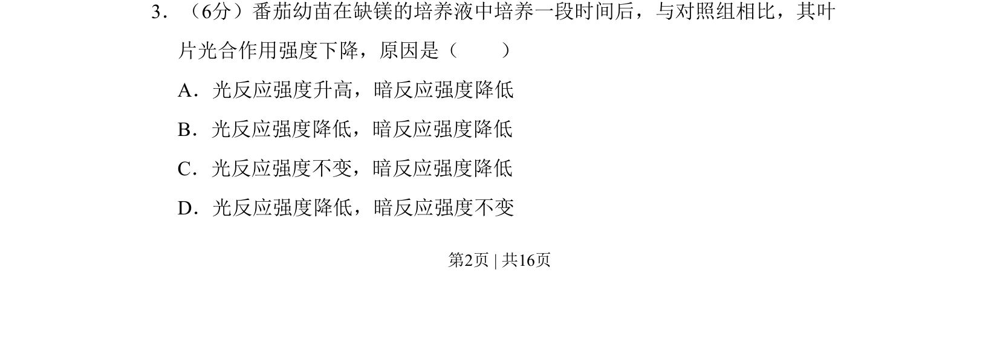
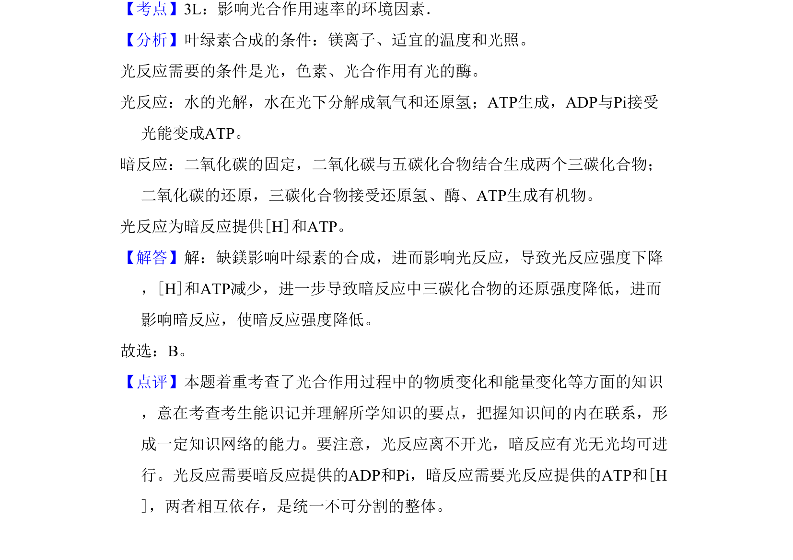

## 题面

## 摘要

缺镁影响叶绿素合成，导致光反应和暗反应强度均下降。

## 关联考点

- [[520-镁与叶绿素合成|镁与叶绿素合成]]
- [[236-光反应|光反应]]
- [[239-暗反应|暗反应]]

## 答案与解析

> 📄 原 PDF 第 2 页：`素材/真题/吉林/2008-2024·（吉林）生物高考真题/2011年高考生物试卷（新课标）（解析卷）.pdf`
