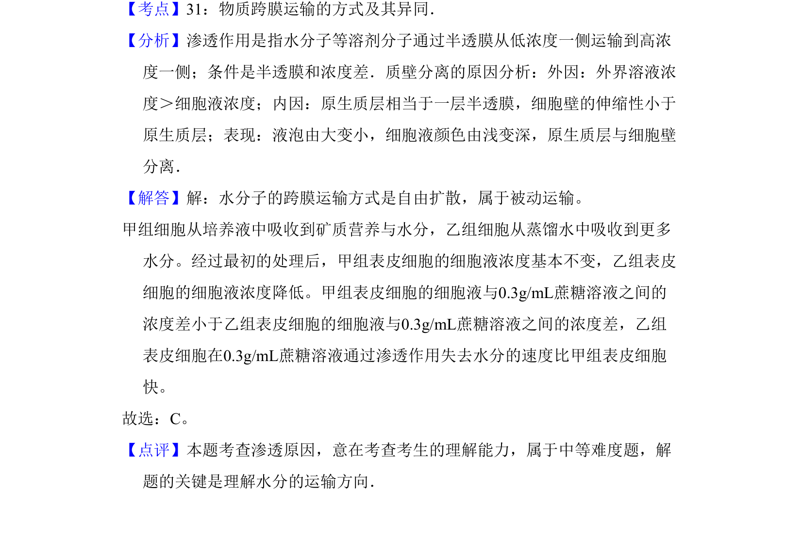

## 题面

## 摘要

比较不同预浸泡处理的洋葱外表皮在蔗糖溶液中的水分渗出量及运输方式。

## 关联考点

- [[258-渗透作用|渗透作用]]
- [[262-质壁分离|质壁分离]]
- [[707-被动运输|被动运输]]

## 答案与解析

> 📄 原 PDF 第 3 页：`素材/真题/吉林/2008-2024·（吉林）生物高考真题/2011年高考生物试卷（新课标）（解析卷）.pdf`
