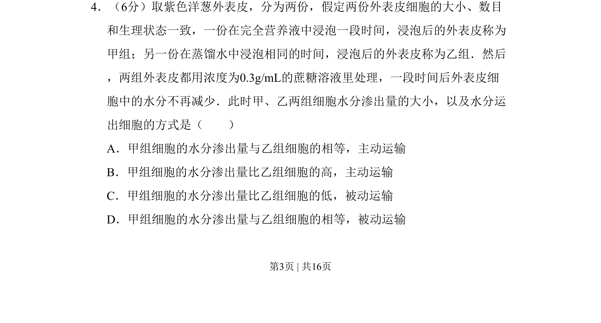
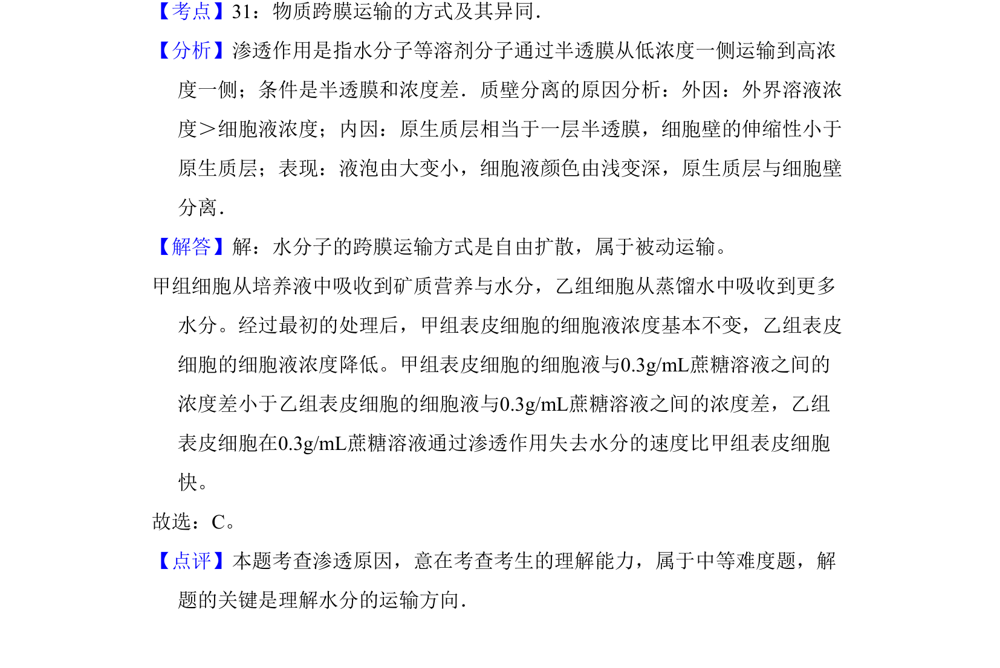

## 题面

## 摘要

比较不同预浸泡处理的洋葱外表皮在蔗糖溶液中的水分渗出量及运输方式。

## 关联考点

- [[258-渗透作用|渗透作用]]
- [[262-质壁分离|质壁分离]]
- [[707-被动运输|被动运输]]

## 答案与解析

> 📄 原 PDF 第 3 页：`素材/真题/吉林/2008-2024·（吉林）生物高考真题/2011年高考生物试卷（新课标）（解析卷）.pdf`

<!-- 题干文本-start -->
## 题干文本
4．（6分）取紫色洋葱外表皮，分为两份，假定两份外表皮细胞的大小、数目
和生理状态一致，一份在完全营养液中浸泡一段时间，浸泡后的外表皮称为
甲组；另一份在蒸馏水中浸泡相同的时间，浸泡后的外表皮称为乙组．然后
，两组外表皮都用浓度为0.3g/mL的蔗糖溶液里处理，一段时间后外表皮细
胞中的水分不再减少．此时甲、乙两组细胞水分渗出量的大小，以及水分运
出细胞的方式是（　　）
A．甲组细胞的水分渗出量与乙组细胞的相等，主动运输
B．甲组细胞的水分渗出量比乙组细胞的高，主动运输
C．甲组细胞的水分渗出量比乙组细胞的低，被动运输
D．甲组细胞的水分渗出量与乙组细胞的相等，被动运输
<!-- 题干文本-end -->

<!-- 解析文本-start -->
## 解析文本

<!-- 解析文本-end -->
