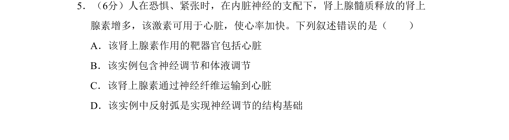
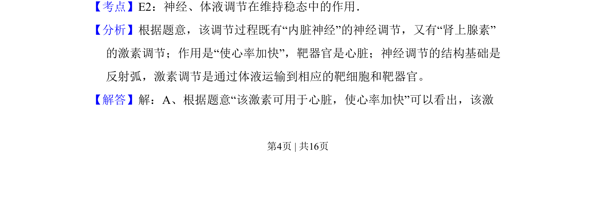
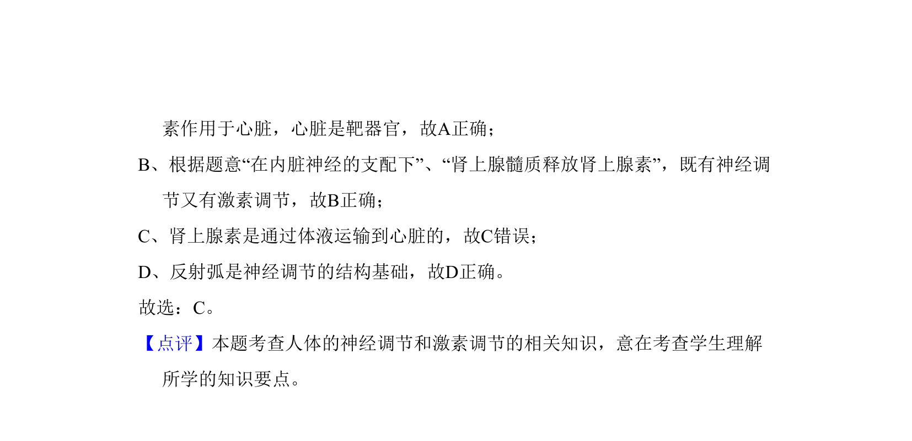

## 题面

## 摘要

人在恐惧时神经调节和激素调节共同作用使心率加快，分析相关叙述正误

## 关联考点

- [[324-神经调节|神经调节]]
- [[330-体液调节|体液调节]]
- [[085-反射弧（初中）|反射弧]]
- [[498-激素运输|激素运输]]

## 答案与解析

> 📄 原 PDF 第 4 页：`素材/真题/吉林/2008-2024·（吉林）生物高考真题/2011年高考生物试卷（新课标）（解析卷）.pdf`

<!-- 题干文本-start -->
## 题干文本
5．（6分）人在恐惧、紧张时，在内脏神经的支配下，肾上腺髓质释放的肾上
腺素增多，该激素可用于心脏，使心率加快。下列叙述错误的是（　　）
A．该肾上腺素作用的靶器官包括心脏
B．该实例包含神经调节和体液调节
C．该肾上腺素通过神经纤维运输到心脏
D．该实例中反射弧是实现神经调节的结构基础
<!-- 题干文本-end -->

<!-- 解析文本-start -->
## 解析文本
【考点】E2：神经、体液调节在维持稳态中的作用．菁优网版权所有
【分析】根据题意，该调节过程既有“内脏神经”的神经调节，又有“肾上腺素”
的激素调节；作用是“使心率加快”，靶器官是心脏；神经调节的结构基础是
反射弧，激素调节是通过体液运输到相应的靶细胞和靶器官。
【解答】解：A、根据题意“该激素可用于心脏，使心率加快”可以看出，该激
<!-- 解析文本-end -->
