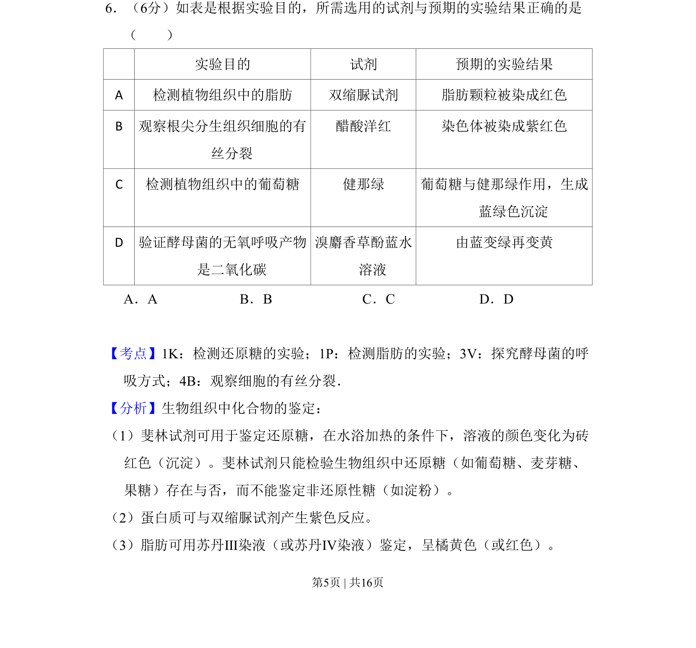
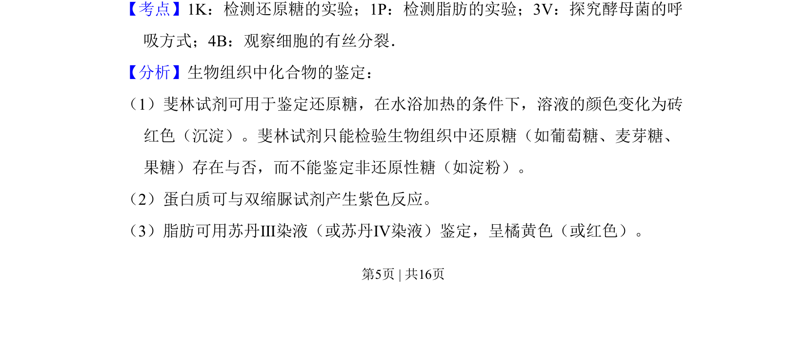
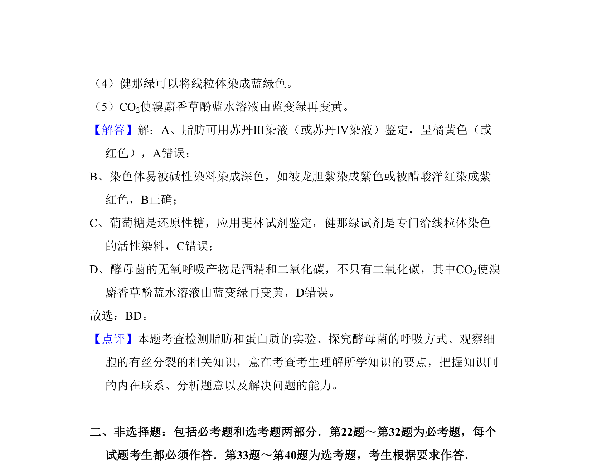

## 题面

## 摘要

生物实验试剂与预期结果的正误判断

## 关联考点

- [[777-检测还原糖|检测还原糖]]
- [[620-检测脂肪|检测脂肪]]
- [[795-观察有丝分裂|观察有丝分裂]]
- [[603-探究酵母菌呼吸|探究酵母菌呼吸]]

## 答案与解析

> 📄 原 PDF 第 5 页：`素材/真题/吉林/2008-2024·（吉林）生物高考真题/2011年高考生物试卷（新课标）（解析卷）.pdf`

<!-- 题干文本-start -->
## 题干文本
6．（6分）如表是根据实验目的，所需选用的试剂与预期的实验结果正确的是
（　　） 
 实验目的 试剂 预期的实验结果
A 检测植物组织中的脂肪 双缩脲试剂 脂肪颗粒被染成红色
B 观察根尖分生组织细胞的有
丝分裂
醋酸洋红 染色体被染成紫红色
C 检测植物组织中的葡萄糖 健那绿 葡萄糖与健那绿作用，生成
蓝绿色沉淀
D 验证酵母菌的无氧呼吸产物
是二氧化碳
溴麝香草酚蓝水
溶液
由蓝变绿再变黄
A．A B．B C．C D．D
<!-- 题干文本-end -->

<!-- 解析文本-start -->
## 解析文本
【考点】1K：检测还原糖的实验；1P：检测脂肪的实验；3V：探究酵母菌的呼
吸方式；4B：观察细胞的有丝分裂．菁优网版权所有
【分析】生物组织中化合物的鉴定：
（1）斐林试剂可用于鉴定还原糖，在水浴加热的条件下，溶液的颜色变化为砖
红色（沉淀）。斐林试剂只能检验生物组织中还原糖（如葡萄糖、麦芽糖、
果糖）存在与否，而不能鉴定非还原性糖（如淀粉）。
（2）蛋白质可与双缩脲试剂产生紫色反应。
（3）脂肪可用苏丹Ⅲ染液（或苏丹Ⅳ染液）鉴定，呈橘黄色（或红色）。
<!-- 解析文本-end -->
