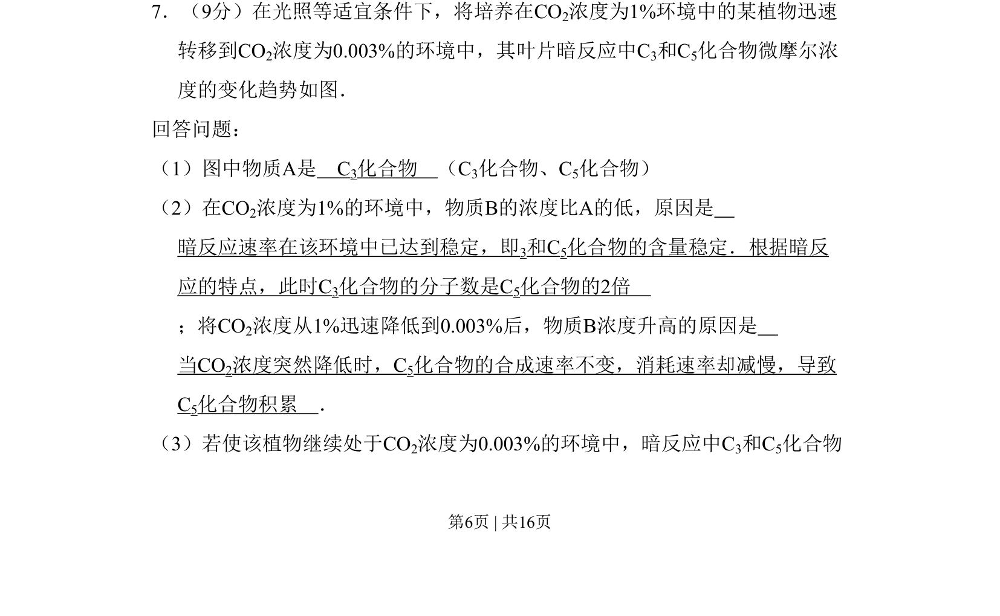

## 题面

## 摘要

该题通过曲线图分析光合作用暗反应中C3和C5化合物浓度在CO2浓度变化时的动态变化及原因。

## 关联考点

- [[033-光合作用|光合作用]]
- [[239-暗反应|暗反应]]
- [[C3]]
- [[C5]]
- [[CO2浓度]]

## 答案与解析

> 📄 原 PDF 第 6 页：`素材/真题/吉林/2008-2024·（吉林）生物高考真题/2011年高考生物试卷（新课标）（解析卷）.pdf`
