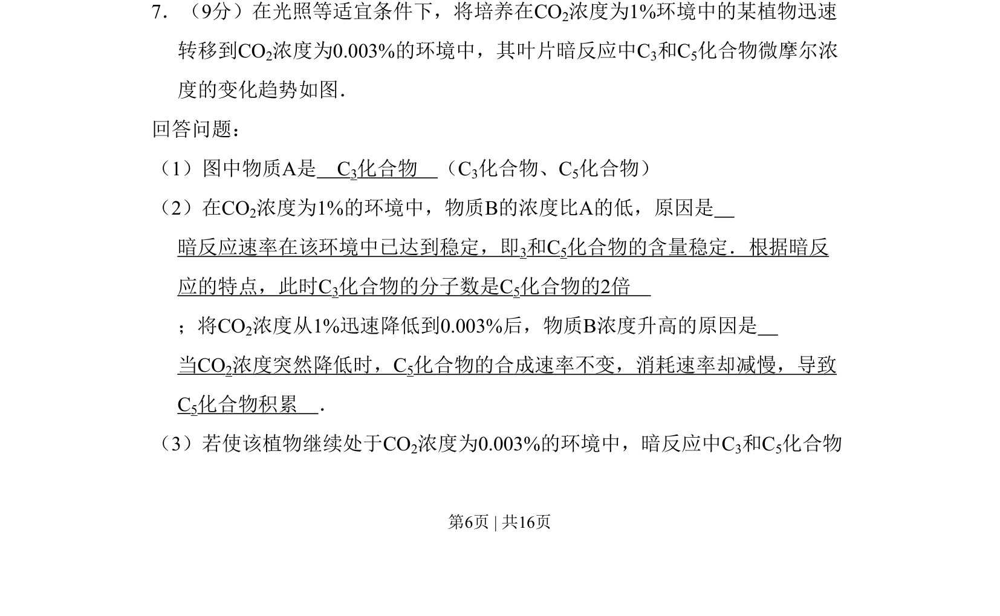
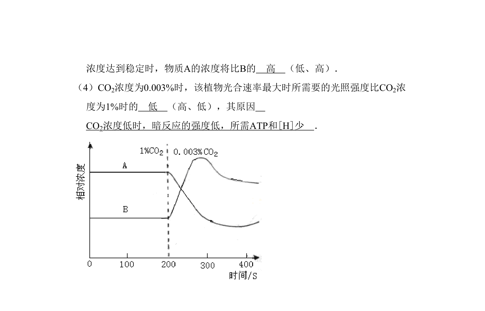
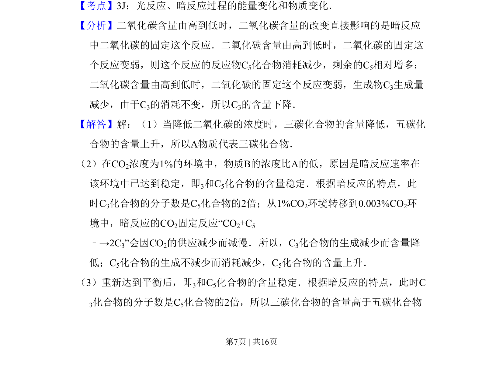
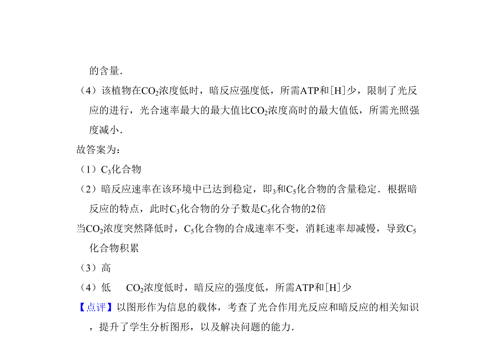

## 题面

## 摘要

该题通过曲线图分析光合作用暗反应中C3和C5化合物浓度在CO2浓度变化时的动态变化及原因。

## 关联考点

- [[033-光合作用|光合作用]]
- [[239-暗反应|暗反应]]
- [[459-C3|C3]]
- [[460-C5|C5]]
- [[523-CO2浓度|CO2浓度]]

## 答案与解析

> 📄 原 PDF 第 6 页：`素材/真题/吉林/2008-2024·（吉林）生物高考真题/2011年高考生物试卷（新课标）（解析卷）.pdf`

<!-- 题干文本-start -->
## 题干文本
7．（9分）在光照等适宜条件下，将培养在CO2浓度为1%环境中的某植物迅速
转移到CO2浓度为0.003%的环境中，其叶片暗反应中C3和C5化合物微摩尔浓
度的变化趋势如图．
回答问题：
（1）图中物质A是　C3化合物　（C3化合物、C5化合物）
（2）在CO2浓度为1%的环境中，物质B的浓度比A的低，原因是　
暗反应速率在该环境中已达到稳定，即3和C5化合物的含量稳定．根据暗反
应的特点，此时C3化合物的分子数是C5化合物的2倍　
；将CO2浓度从1%迅速降低到0.003%后，物质B浓度升高的原因是　
当CO2浓度突然降低时，C5化合物的合成速率不变，消耗速率却减慢，导致
C5化合物积累　．
（3）若使该植物继续处于CO2浓度为0.003%的环境中，暗反应中C3和C5化合物
<!-- 题干文本-end -->

<!-- 解析文本-start -->
## 解析文本

<!-- 解析文本-end -->
