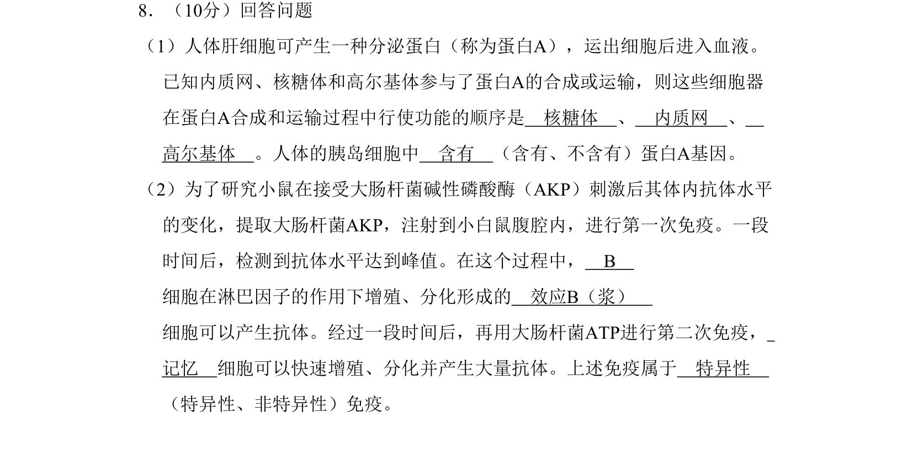
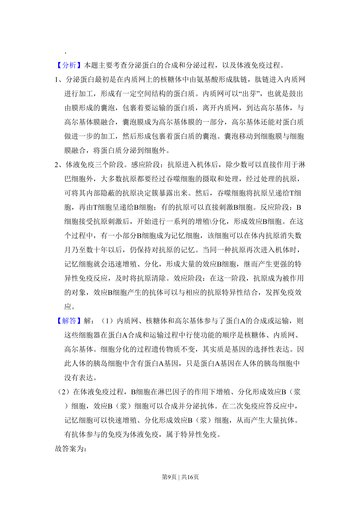
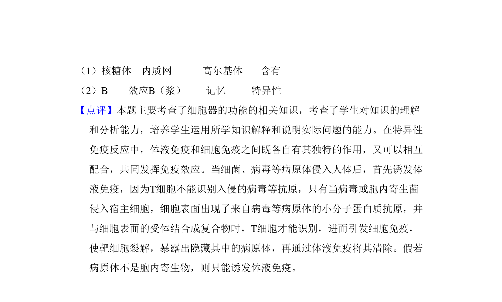

## 题面

## 摘要

该题考查分泌蛋白的合成运输顺序以及体液免疫的过程与特点。

## 关联考点

- [[677-细胞器之间的协调配合|细胞器之间的协调配合]]
- [[540-人体免疫系统在维持稳态中的作用|人体免疫系统在维持稳态中的作用]]

## 答案与解析

> 📄 原 PDF 第 8 页：`素材/真题/吉林/2008-2024·（吉林）生物高考真题/2011年高考生物试卷（新课标）（解析卷）.pdf`

<!-- 题干文本-start -->
## 题干文本
8．（10分）回答问题
（1）人体肝细胞可产生一种分泌蛋白（称为蛋白A），运出细胞后进入血液。
已知内质网、核糖体和高尔基体参与了蛋白A的合成或运输，则这些细胞器
在蛋白A合成和运输过程中行使功能的顺序是　核糖体　、　内质网　、　
高尔基体　。人体的胰岛细胞中　含有　（含有、不含有）蛋白A基因。
（2）为了研究小鼠在接受大肠杆菌碱性磷酸酶（AKP）刺激后其体内抗体水平
的变化，提取大肠杆菌AKP，注射到小白鼠腹腔内，进行第一次免疫。一段
时间后，检测到抗体水平达到峰值。在这个过程中，　B　
细胞在淋巴因子的作用下增殖、分化形成的　效应B（浆）　
细胞可以产生抗体。经过一段时间后，再用大肠杆菌ATP进行第二次免疫，　
记忆　细胞可以快速增殖、分化并产生大量抗体。上述免疫属于　特异性　
（特异性、非特异性）免疫。
<!-- 题干文本-end -->

<!-- 解析文本-start -->
## 解析文本
【考点】2H：细胞器之间的协调配合；E4：人体免疫系统在维持稳态中的作用
<!-- 解析文本-end -->
