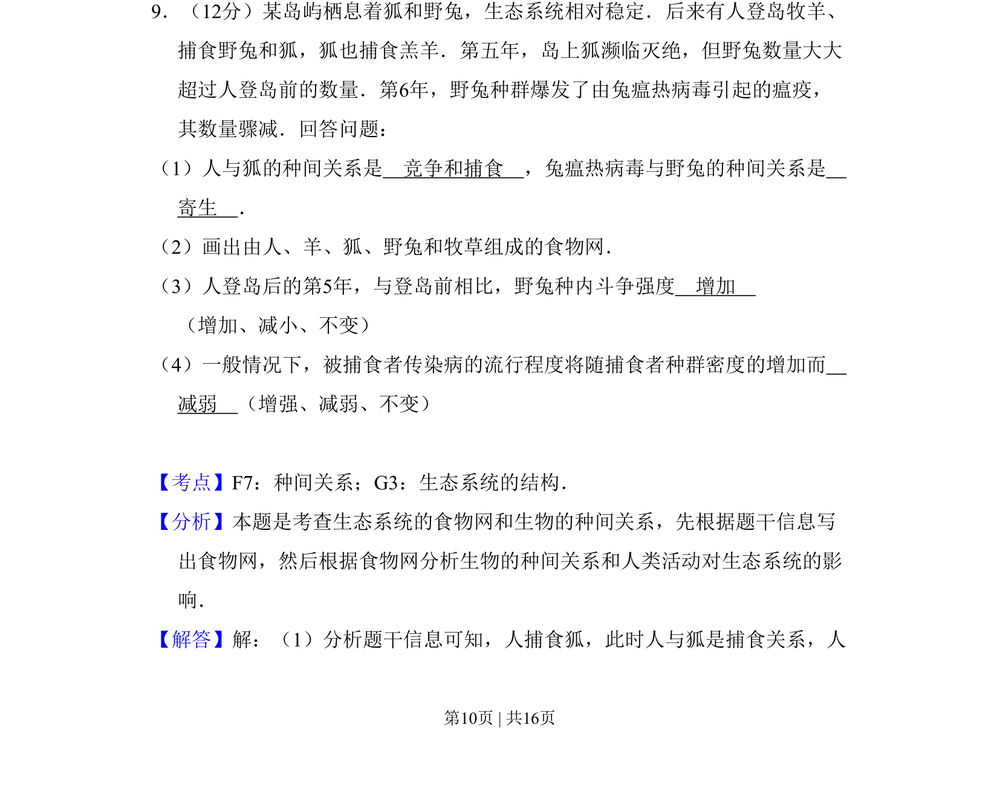
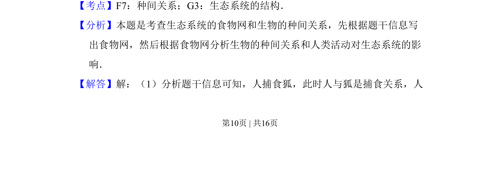
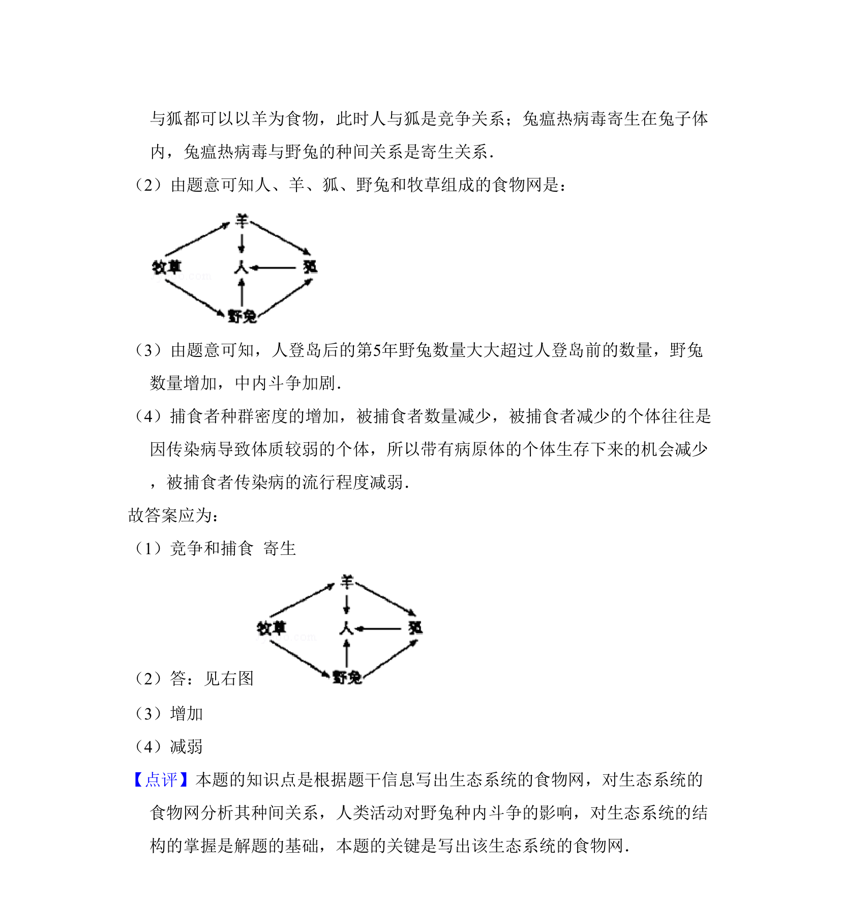

## 题面

## 摘要

本题为生态系统相关试题，考查种间关系判断、食物网构建及种群动态分析。

## 关联考点

- [[022-生物因素|种间关系]]
- [[503-生态系统结构|生态系统结构]]
- [[027-食物网|食物网]]

## 答案与解析

> 📄 原 PDF 第 10 页：`素材/真题/吉林/2008-2024·（吉林）生物高考真题/2011年高考生物试卷（新课标）（解析卷）.pdf`
