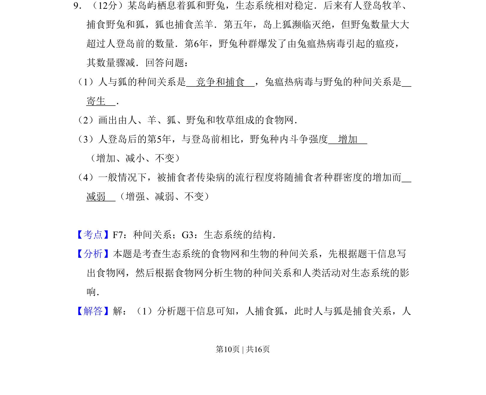
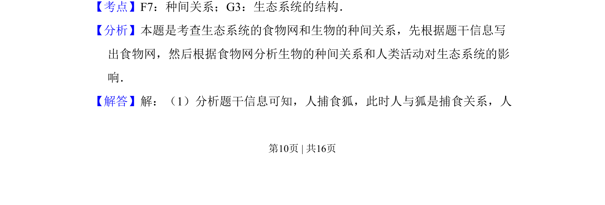
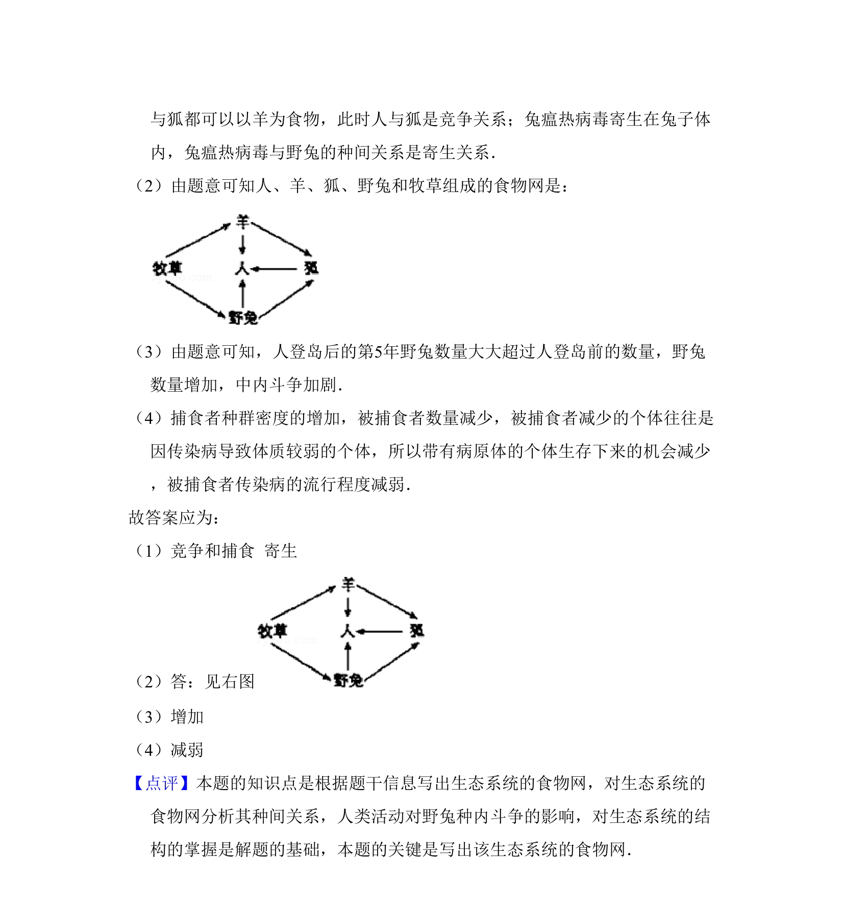

## 题面

## 摘要

本题为生态系统相关试题，考查种间关系判断、食物网构建及种群动态分析。

## 关联考点

- [[022-生物因素|种间关系]]
- [[502-生态系统的结构|生态系统结构]]
- [[027-食物网|食物网]]

## 答案与解析

> 📄 原 PDF 第 10 页：`素材/真题/吉林/2008-2024·（吉林）生物高考真题/2011年高考生物试卷（新课标）（解析卷）.pdf`

<!-- 题干文本-start -->
## 题干文本
9．（12分）某岛屿栖息着狐和野兔，生态系统相对稳定．后来有人登岛牧羊、
捕食野兔和狐，狐也捕食羔羊．第五年，岛上狐濒临灭绝，但野兔数量大大
超过人登岛前的数量．第6年，野兔种群爆发了由兔瘟热病毒引起的瘟疫，
其数量骤减．回答问题：
（1）人与狐的种间关系是　竞争和捕食　，兔瘟热病毒与野兔的种间关系是　
寄生　．
（2）画出由人、羊、狐、野兔和牧草组成的食物网．
（3）人登岛后的第5年，与登岛前相比，野兔种内斗争强度　增加　
（增加、减小、不变）
（4）一般情况下，被捕食者传染病的流行程度将随捕食者种群密度的增加而　
减弱　（增强、减弱、不变）
<!-- 题干文本-end -->

<!-- 解析文本-start -->
## 解析文本
【考点】F7：种间关系；G3：生态系统的结构．菁优网版权所有
【分析】本题是考查生态系统的食物网和生物的种间关系，先根据题干信息写
出食物网，然后根据食物网分析生物的种间关系和人类活动对生态系统的影
响．
【解答】解：（1）分析题干信息可知，人捕食狐，此时人与狐是捕食关系，人
<!-- 解析文本-end -->
