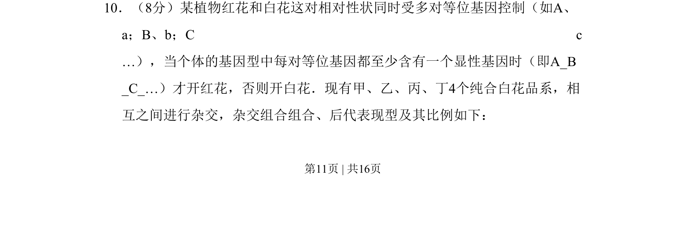
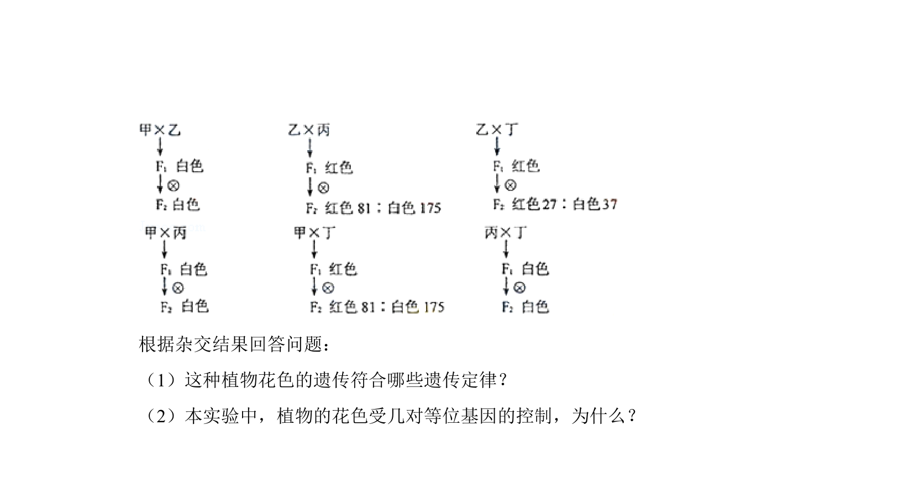
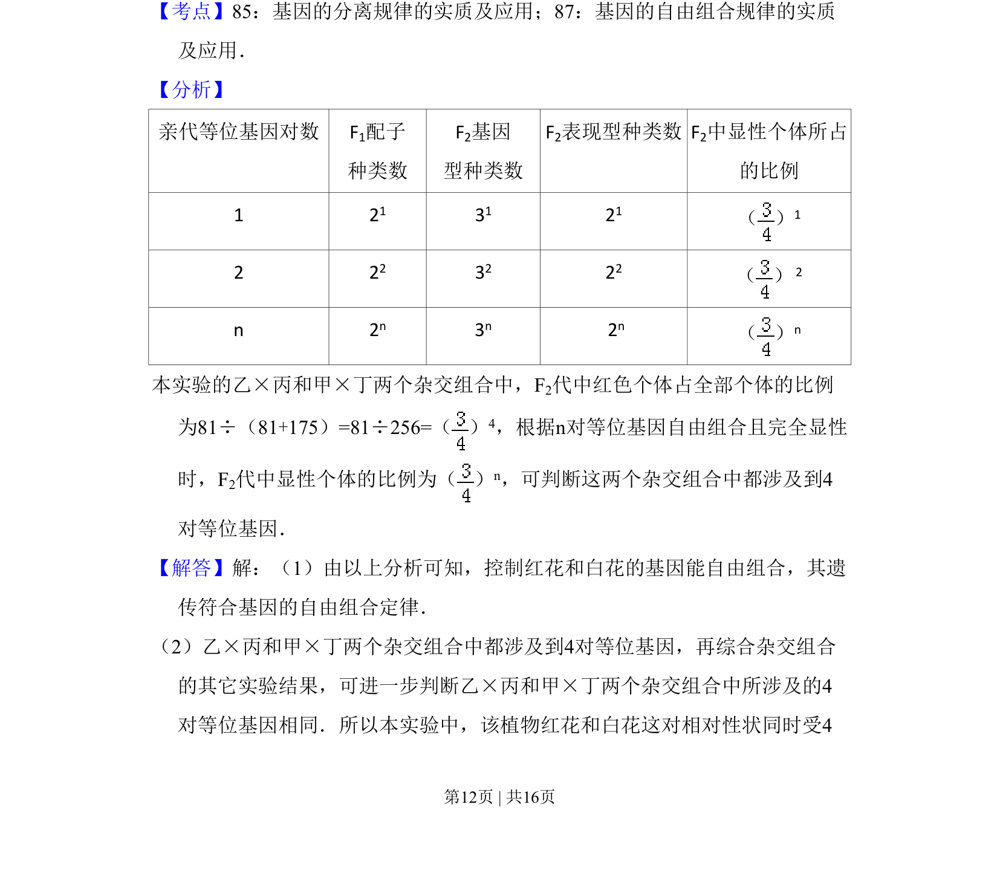
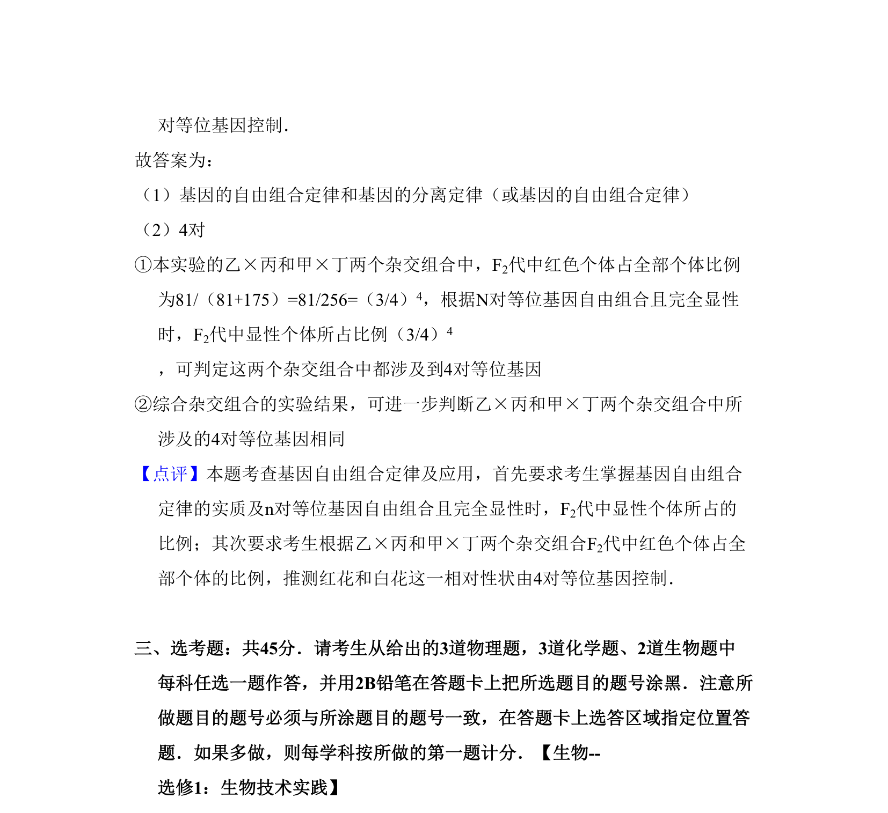

## 题面

## 摘要

多对等位基因控制性状遗传，基于纯合白花品系杂交分析基因互作与比例。

## 关联考点

- [[272-自由组合定律|自由组合定律]]
- [[573-基因互作|基因互作]]
- [[948-概率计算|概率计算]]

## 答案与解析

> 📄 原 PDF 第 11 页：`素材/真题/吉林/2008-2024·（吉林）生物高考真题/2011年高考生物试卷（新课标）（解析卷）.pdf`

<!-- 题干文本-start -->
## 题干文本
10．（8分）某植物红花和白花这对相对性状同时受多对等位基因控制（如A、
a；B、b；C c 
…），当个体的基因型中每对等位基因都至少含有一个显性基因时（即A_B
_C_…）才开红花，否则开白花．现有甲、乙、丙、丁4个纯合白花品系，相
互之间进行杂交，杂交组合组合、后代表现型及其比例如下：
<!-- 题干文本-end -->

<!-- 解析文本-start -->
## 解析文本

<!-- 解析文本-end -->
