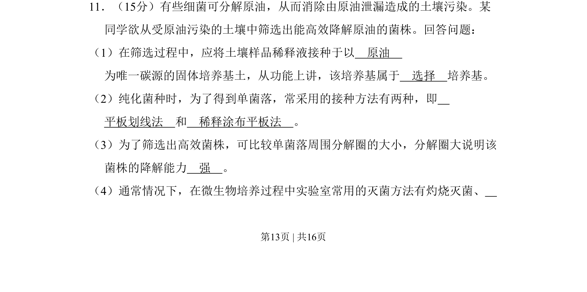
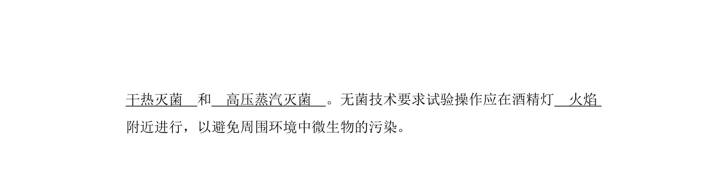
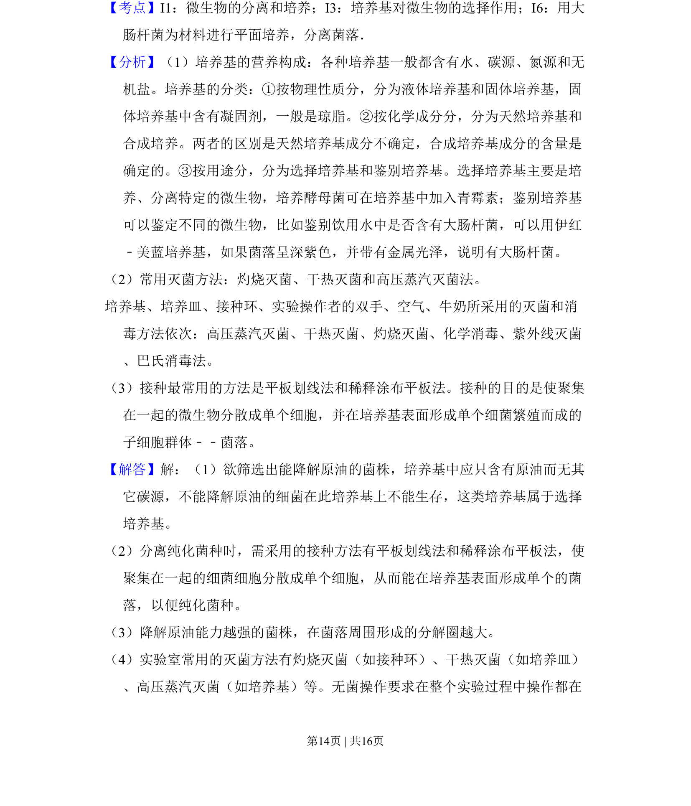
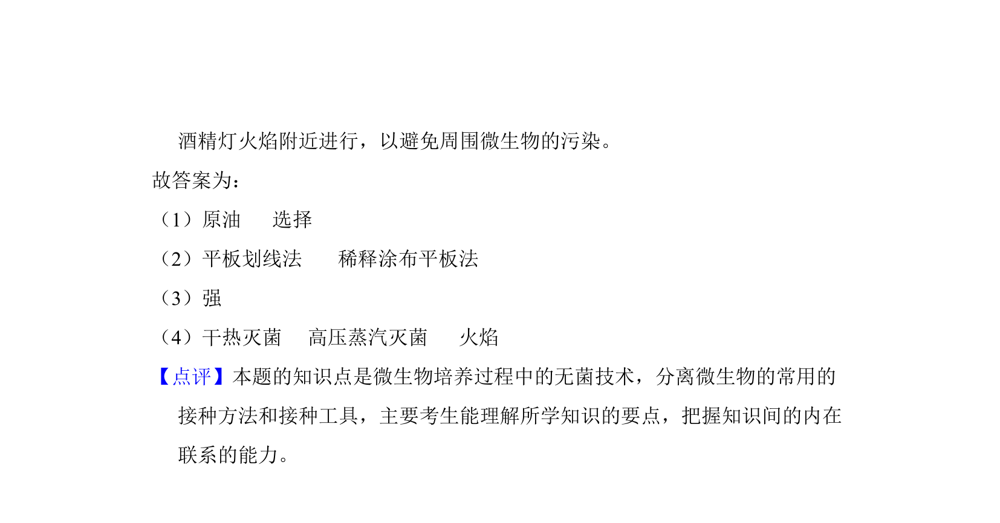

## 题面

## 摘要

该题考查从土壤中筛选原油降解菌的实验，涉及选择培养基、接种方法及降解能力判断。

## 关联考点

- [[427-培养基|选择培养基]]
- [[594-平板划线法|平板划线法]]
- [[755-稀释涂布平板法|稀释涂布平板法]]
- [[488-微生物分离与筛选|微生物分离与筛选]]

## 答案与解析

> 📄 原 PDF 第 13 页：`素材/真题/吉林/2008-2024·（吉林）生物高考真题/2011年高考生物试卷（新课标）（解析卷）.pdf`

<!-- 题干文本-start -->
## 题干文本
11．（15分）有些细菌可分解原油，从而消除由原油泄漏造成的土壤污染。某
同学欲从受原油污染的土壤中筛选出能高效降解原油的菌株。回答问题：
（1）在筛选过程中，应将土壤样品稀释液接种于以　原油　
为唯一碳源的固体培养基土，从功能上讲，该培养基属于　选择　培养基。
（2）纯化菌种时，为了得到单菌落，常采用的接种方法有两种，即　
平板划线法　和　稀释涂布平板法　。
（3）为了筛选出高效菌株，可比较单菌落周围分解圈的大小，分解圈大说明该
菌株的降解能力　强　。
（4）通常情况下，在微生物培养过程中实验室常用的灭菌方法有灼烧灭菌、
<!-- 题干文本-end -->

<!-- 解析文本-start -->
## 解析文本

<!-- 解析文本-end -->
