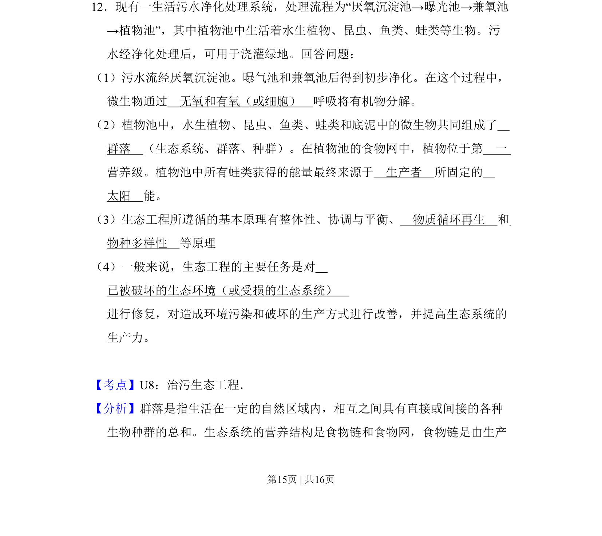

## 题面

## 摘要

该题考查生态工程中污水处理流程、群落及营养级、生态工程原理等知识。

## 关联考点

- [[治污生态工程]]
- [[374-群落|群落]]
- [[389-营养级|营养级]]
- [[442-生态工程原理|生态工程原理]]

## 答案与解析

> 📄 原 PDF 第 15 页：`素材/真题/吉林/2008-2024·（吉林）生物高考真题/2011年高考生物试卷（新课标）（解析卷）.pdf`
