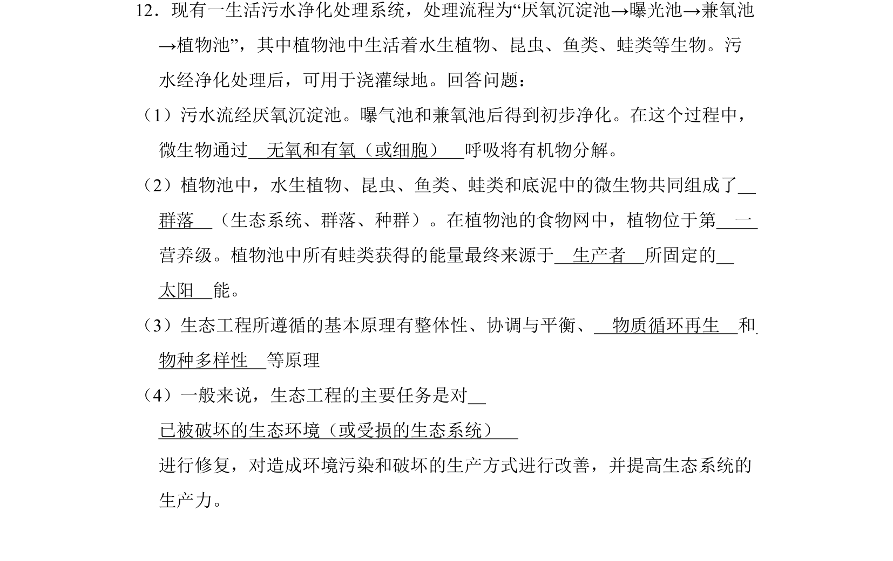
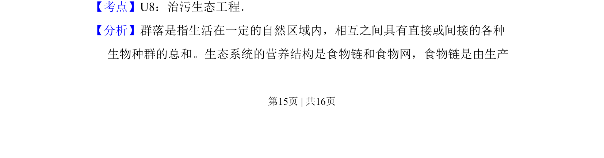
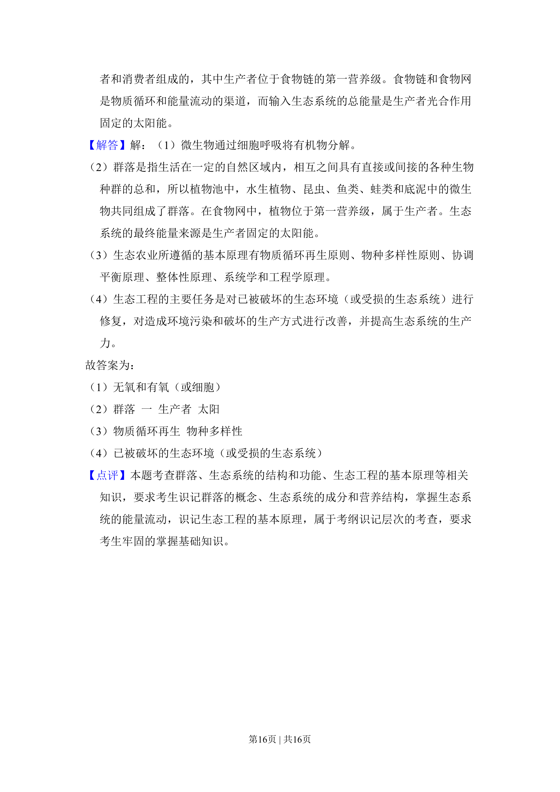

## 题面

## 摘要

该题考查生态工程中污水处理流程、群落及营养级、生态工程原理等知识。

## 关联考点

- [[626-治污生态工程|治污生态工程]]
- [[374-群落|群落]]
- [[389-营养级|营养级]]
- [[442-生态工程原理|生态工程原理]]

## 答案与解析

> 📄 原 PDF 第 15 页：`素材/真题/吉林/2008-2024·（吉林）生物高考真题/2011年高考生物试卷（新课标）（解析卷）.pdf`

<!-- 题干文本-start -->
## 题干文本
12．现有一生活污水净化处理系统，处理流程为“厌氧沉淀池→曝光池→兼氧池
→植物池”，其中植物池中生活着水生植物、昆虫、鱼类、蛙类等生物。污
水经净化处理后，可用于浇灌绿地。回答问题：
（1）污水流经厌氧沉淀池。曝气池和兼氧池后得到初步净化。在这个过程中，
微生物通过　无氧和有氧（或细胞）　呼吸将有机物分解。
（2）植物池中，水生植物、昆虫、鱼类、蛙类和底泥中的微生物共同组成了　
群落　（生态系统、群落、种群）。在植物池的食物网中，植物位于第　一　
营养级。植物池中所有蛙类获得的能量最终来源于　生产者　所固定的　
太阳　能。
（3）生态工程所遵循的基本原理有整体性、协调与平衡、　物质循环再生　和　
物种多样性　等原理
（4）一般来说，生态工程的主要任务是对　
已被破坏的生态环境（或受损的生态系统）　
进行修复，对造成环境污染和破坏的生产方式进行改善，并提高生态系统的
生产力。
<!-- 题干文本-end -->

<!-- 解析文本-start -->
## 解析文本
【考点】U8：治污生态工程．菁优网版权所有
【分析】群落是指生活在一定的自然区域内，相互之间具有直接或间接的各种
生物种群的总和。生态系统的营养结构是食物链和食物网，食物链是由生产
<!-- 解析文本-end -->
