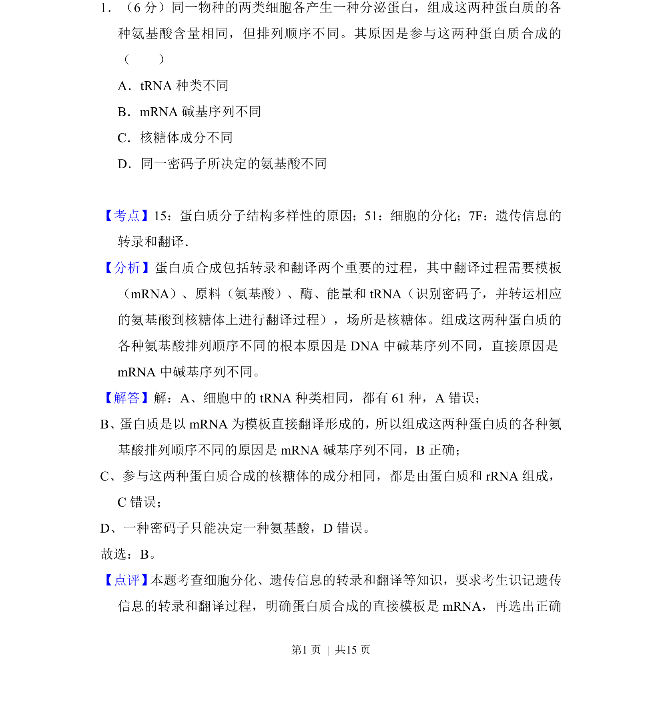
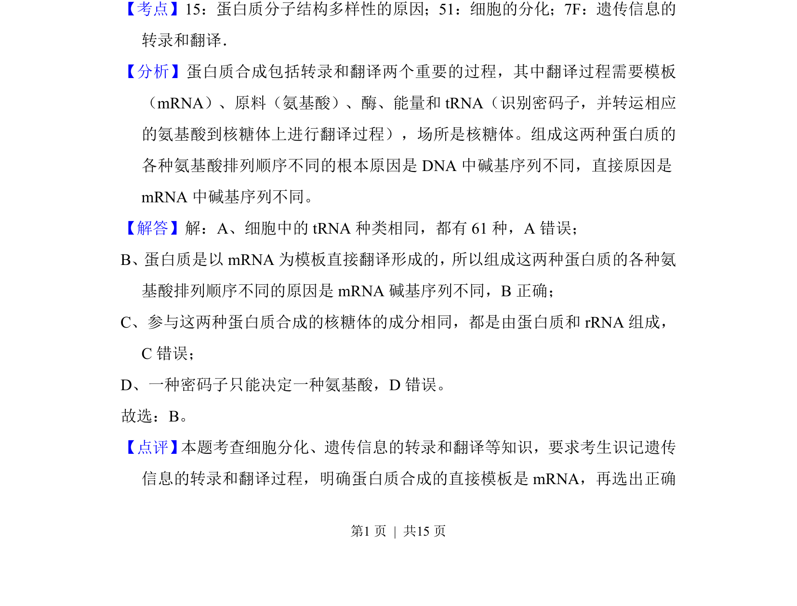

## 题面

## 摘要

本题考查蛋白质结构多样性的直接原因，涉及遗传信息的翻译过程。

## 关联考点

- [[蛋白质结构多样性]]
- [[遗传信息翻译]]
- [[mRNA模板]]
- [[045-细胞分化|细胞分化]]

## 答案与解析

> 📄 原 PDF 第 1 页：`素材/真题/吉林/2008-2024·（吉林）生物高考真题/2012年高考生物试卷（新课标）（解析卷）.pdf`
