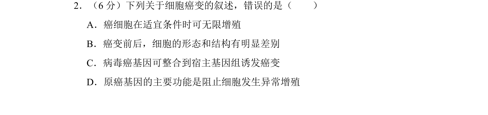

## 题面

## 摘要

本题考查癌细胞的特征及癌变原因，要求识记相关知识点并判断选项正误。

## 关联考点

- [[815-癌细胞特征|癌细胞特征]]
- [[797-细胞癌变原因|细胞癌变原因]]
- [[563-原癌基因功能|原癌基因功能]]

## 答案与解析

> 📄 原 PDF 第 2 页：`素材/真题/吉林/2008-2024·（吉林）生物高考真题/2012年高考生物试卷（新课标）（解析卷）.pdf`
